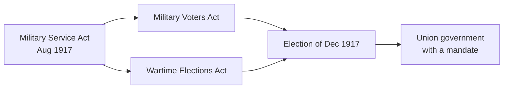

By 1917 the arithmetic had stopped working. Casualties were higher than
voluntary enlistment could replace, and Prime Minister Robert Borden — who
had promised there would be no compulsory service — changed his mind. The
*Military Service Act* passed in late August 1917, making male citizens
between twenty and forty-five liable for military service.

## What was actually being argued about

It is tempting to reduce this to French Canada against English Canada. That
is too simple, and it hides the real positions. Opposition in Quebec was
strong, but so was opposition among farmers, who had been promised their sons
would be exempt and then watched exemptions narrow; among many organized
workers, who saw a government conscripting labour but not wealth; and among
recent immigrants from pacifist religious communities.

Henri Bourassa's argument was not that Germany was right. It was that Canada
was being asked to bleed for an empire whose government at the same time
tolerated Ontario's Regulation 17, which sharply restricted French-language
instruction in that province's schools. If the country would not defend
French where French Canadians actually lived, why compel them to defend it in
Flanders?

## How the government made sure it won

Both election statutes were adopted on 20 September 1917. One enfranchised
serving soldiers and nurses. The other gave the federal vote to the close
female relatives of servicemen while taking it away from people born in enemy
countries who had been naturalized after 31 March 1902, and from
conscientious objectors. The government redrew the electorate before the
election. Over ninety per cent of the military vote went to Borden's ticket.

## What followed

Enforcement provoked riots in Quebec City at Easter 1918 in which four
civilians were killed and dozens injured. The Canadian War Museum records
that by the Armistice about 48,000 conscripts had been sent overseas, roughly
half of whom served at the front. Whether that was worth the damage to
national unity is a live historical question, and your answer depends on what
you decide to weigh.

Bring [[Historical Perspective]] to bear before you judge anyone here, then
build the case in [[The War Question]].

%%curriculum-start%%
## Curriculum connection

![[B2.3]]
%%curriculum-end%%
