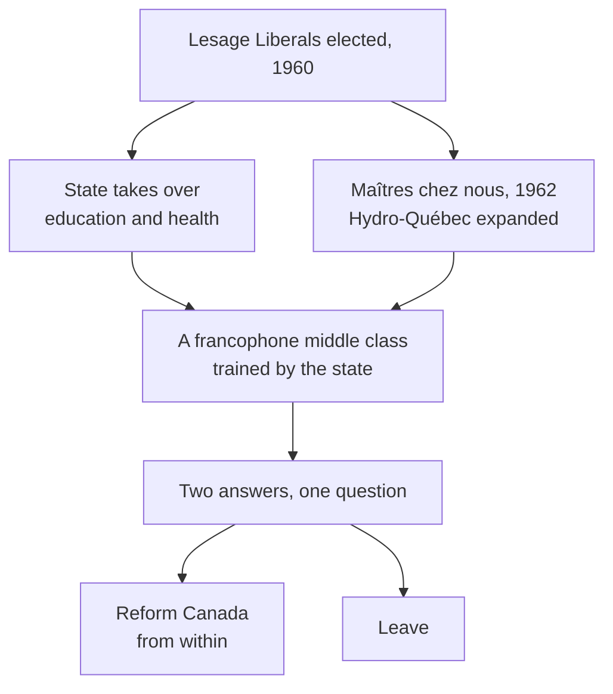

The Quiet Revolution is the name for what happened in Quebec in the 1960s: a
rapid, deliberate transfer of authority over education, health and the
economy from the Catholic Church and English-owned business to the provincial
state. It was called quiet because it was done by legislation rather than by
force. Nothing else about it was quiet.

## What it was reacting against

Under Maurice Duplessis, who governed Quebec for most of the period from the
1930s to his death in 1959, the province combined conservative Catholic
social authority, hostility to unions, and welcome for outside investment on
outside terms. Schools and hospitals were run by religious orders.
Francophones were a large majority of the population and a small minority of
the managers in their own economy. The complaint that produced the Quiet
Revolution was concrete: a French speaker in Montreal was expected to work in
English, for less money.

Both answers came from the same generation and often the same classrooms.
Pierre Trudeau went to Ottawa to argue that a bilingual Canada could contain
Quebec; René Lévesque left the Liberals to argue that it could not. The
federal response included a royal commission on bilingualism and
biculturalism and, in 1969, the *Official Languages Act*.

## The violent edge, and the state's answer

A small group, the Front de libération du Québec, set bombs through the
decade and in October 1970 kidnapped a British trade commissioner and a
Quebec cabinet minister, Pierre Laporte, who was killed. Ottawa invoked the
*War Measures Act*, putting soldiers on Montreal streets and permitting mass
arrests without charge. Most Canadians supported it at the time. Many of
those arrested had nothing to do with the FLQ, and the October Crisis is
still argued about as the clearest postwar test of what a democracy will
suspend when it is frightened.

The Parti Québécois formed the government in 1976 and legislated the Charter
of the French Language, making French the language of work, commerce and
schooling. On 20 May 1980 it put sovereignty-association to a referendum.
Élections Québec records the result as 59.56 per cent No to 40.44 per cent
Yes, on a turnout of 85.61 per cent — and the federalist campaign had
promised constitutional renewal in exchange. What Quebec got two years later
is the subject of the next unit. First Nations and Inuit in
Quebec were not neutral in any of this and did not line up behind either
side: their own territorial and treaty claims cut across the argument
entirely.

Carry the question into [[Patriation, the Charter, and After]], and use
[[Cause and Consequence]] to trace what 1960 set in motion.

%%curriculum-start%%
## Curriculum connection

![[D3.4]]
%%curriculum-end%%
