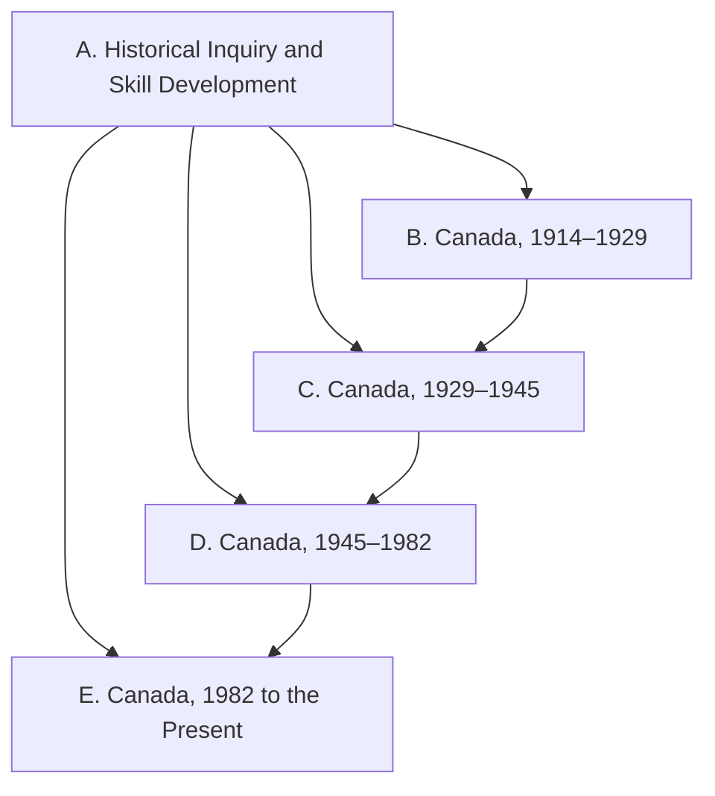

Everything this course does points at one or more of these expectations,
from **CHC2D — Canadian History since World War I, Grade 10**. Every
source, investigation, and task links back to the codes it addresses.

> [!info] Where these come from
> The wording below is the Ontario curriculum's own, from the version
> issued in February 2026. See [[About These Expectations]] — including
> why the version matters more than usual for this course.

Strand A runs through the whole course rather than sitting in one unit —
its own stem says *throughout this course*. The four period strands each
ask the same three questions of a different era: what the context was,
how communities cooperated and came into conflict, and what it did to
identity, citizenship, and heritage.

## Overall and specific expectations

### Strand A. Historical Inquiry and Skill Development
*By the end of this course, students will:*

![[A1. Historical Inquiry]]
![[A1.1]]
![[A1.2]]
![[A1.3]]
![[A1.4]]
![[A1.5]]
![[A1.6]]
![[A1.7]]
![[A1.8]]
![[A1.9]]
![[A2. Developing Transferable Skills]]
![[A2.1]]
![[A2.2]]
![[A2.3]]
![[A2.4]]

### Strand B. Canada, 1914–1929
*By the end of this course, students will:*

![[B1. Social, Economic, and Political Context]]
![[B1.1]]
![[B1.2]]
![[B1.3]]
![[B1.4]]
![[B2. Communities, Conflict, and Cooperation]]
![[B2.1]]
![[B2.2]]
![[B2.3]]
![[B2.4]]
![[B2.5]]
![[B2.6]]
![[B3. Identity, Citizenship, and Heritage]]
![[B3.1]]
![[B3.2]]
![[B3.3]]
![[B3.4]]

### Strand C. Canada, 1929–1945
*By the end of this course, students will:*

![[C1. Social, Economic, and Political Context]]
![[C1.1]]
![[C1.2]]
![[C1.3]]
![[C1.4]]
![[C1.5]]
![[C1.6]]
![[C2. Communities, Conflict, and Cooperation]]
![[C2.1]]
![[C2.2]]
![[C2.3]]
![[C2.4]]
![[C2.5]]
![[C2.6]]
![[C3. Identity, Citizenship, and Heritage]]
![[C3.1]]
![[C3.2]]
![[C3.3]]
![[C3.4]]

### Strand D. Canada, 1945–1982
*By the end of this course, students will:*

![[D1. Social, Economic, and Political Context]]
![[D1.1]]
![[D1.2]]
![[D1.3]]
![[D1.4]]
![[D1.5]]
![[D1.6]]
![[D2. Communities, Conflict, and Cooperation]]
![[D2.1]]
![[D2.2]]
![[D2.3]]
![[D2.4]]
![[D2.5]]
![[D2.6]]
![[D3. Identity, Citizenship, and Heritage]]
![[D3.1]]
![[D3.2]]
![[D3.3]]
![[D3.4]]
![[D3.5]]

### Strand E. Canada, 1982 to the Present
*By the end of this course, students will:*

![[E1. Social, Economic, and Political Context]]
![[E1.1]]
![[E1.2]]
![[E1.3]]
![[E1.4]]
![[E1.5]]
![[E2. Communities, Conflict, and Cooperation]]
![[E2.1]]
![[E2.2]]
![[E2.3]]
![[E2.4]]
![[E2.5]]
![[E3. Identity, Citizenship, and Heritage]]
![[E3.1]]
![[E3.2]]
![[E3.3]]
![[E3.4]]
![[E3.5]]
