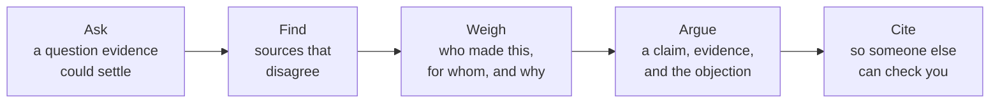

An honest inventory, written in Unit 3 while there is still term left to
act on it: what studying history is actually building in you, with a
specific piece of your own work behind every claim.

Historical investigation is not one skill. It is a chain, and it breaks
at whichever link you have not practised:

## Write one paragraph per link

For each of the five, name **one** thing you did this term, when, and
what it produced. "I can evaluate sources" is worth nothing. "I stopped
using the newspaper report for [[The Source Study]] once I saw it was
printed under wartime censorship, and used the departmental file instead"
is evidence. If a link has no example yet, say so and name the task where
you will fix it.

## Reading against the grain

The skill this course builds that no other subject quite does: reading a
document for what its author was not trying to tell you. A recruitment
poster is weak evidence about the war and excellent evidence about what
the state believed would persuade people — see [[Newspapers and Propaganda]].
Give one example of your own where the source's purpose told you more
than its content did.

## Where it lands outside this room

Pick one skill and one setting that is not school: a claim someone made
online that you now know how to check, an argument at home where you
asked for the source, a photograph you would no longer take at face
value. Be concrete. "Detecting bias" is a phrase; "I looked up who paid
for the study" is a transfer.

## Revisit after the culminating

Come back after [[The Commemoration Inquiry]] and add one paragraph:
which link in the chain failed under pressure? That paragraph is worth
more than the five above it, and it is what [[Where History Leads]] is
built on.

%%curriculum-start%%
## Curriculum connection

![[A2.1]]

![[A2.2]]
%%curriculum-end%%
