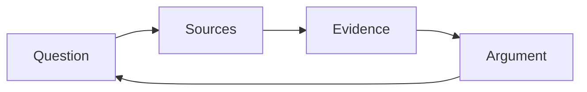

A tour of what these pages can hold — partly so you can read them, partly
so a teacher taking this course over can write them.

## Tables

| Concept | The question it asks |
| --- | --- |
| Significance | Why does this matter, and to whom? |
| Cause and consequence | What brought it about, and what followed? |
| Continuity and change | What stayed the same while this changed? |
| Perspective | What did people at the time believe they were doing? |

A link inside a table cell needs its pipe escaped, or the cell breaks:
write `[[Historical Perspective\|perspective]]` and it renders as
[[Historical Perspective\|perspective]].

## Callouts

> [!tip] A tip
> Something to try before the next class.

> [!warning] A warning
> Used when getting this wrong has a cost.

A callout with a `-` after its type starts folded:

> [!success]- A folded block
> Usually a check-yourself question, so you get to think first. You just
> opened it, which is the demonstration.

## Diagrams

Diagrams are written as text, so they can be edited in place:



## Checklists

- [ ] Reading done
- [ ] Notebook entry written

> [!warning] These do not save
> A checkbox here is printed, not interactive. Nothing is recorded and
> the site does not know who you are. Copy the list into your notebook.

## Footnotes

Useful for an aside that would interrupt the sentence.[^dates]

[^dates]: Dates in this course are written day-month-year — 10 September
1939 — because that is the form most Canadian archival material uses.

A dollar sign starts a mathematical expression, so it has to be escaped:
write `\$14` to get \$14.

## What this course does not use

The site can typeset mathematics and highlight program code, and this
course does neither. Shown once so you know they exist:

$$\text{share} = \frac{\text{arrivals in a year}}{\text{population}}$$

```python
print("not used in this course")
```

Your work here is made of documents, argument, and citation. If you meet
these two in another course, it is the same site doing it.
