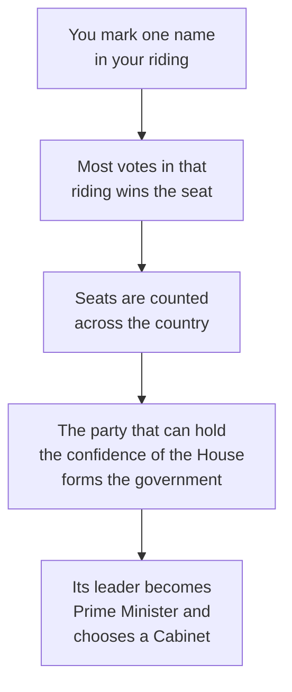

Canada is a constitutional monarchy with a parliamentary democracy and a
federal structure. Three claims in one sentence, and each one changes what
your vote does.

**Constitutional monarchy**: the head of state is the monarch,
represented federally by the Governor General and provincially by a
Lieutenant Governor. They act on the advice of ministers, which is a
constitutional way of saying they sign what an elected government asks
them to sign.

**Parliamentary democracy**: you do not elect a prime minister or a
premier. You elect one member for your riding, and the government is
formed by whoever can hold the confidence of the elected chamber.

**Federal**: powers are divided between orders of government, and neither
can simply overrule the other in the other's field. That is
[[Who Decides What, and Where]].

## What your ballot actually does

Two consequences follow, and both come up every election. A candidate can
win a riding with far less than half the votes cast, because the rule is
most votes, not a majority. And a party can form government without a
majority of seats, provided the House does not vote it down — a minority
government, which in Canada is common rather than exotic.

## The parties, described the way this course describes them

Elections Canada maintains the register of federal parties; there are
more than a dozen registered at any time, and the list is public. The
ones that have elected members in recent Parliaments include the Liberal
Party of Canada, the Conservative Party of Canada, the New Democratic
Party, the Bloc Québécois, and the Green Party of Canada.

A political compass is a way of placing parties on two axes at once —
economic, from more state direction to more market, and social, from more
regulation of personal conduct to less. It is a teaching tool, not a
measurement. Where you put a party is a claim you have to support, using
what the party has actually proposed and done, and reasonable people
place the same party in different spots.

That is the standard this course holds you to. You describe what a party
says it believes, and you show how that belief leads to its position on a
specific issue — a carbon price, a housing program, a criminal sentence.
You do not rate parties as good or bad, here or in your assessed work.
The point is to make the reasoning visible so a reader can judge it.

> [!note] Nothing on this page names who currently holds office
> Leaders, seat counts and governments change, sometimes within a term.
> Look up the current ones at elections.ca and parl.ca when you need
> them, and date what you write down.

[[The Issue Brief]] asks you to do exactly that for one issue, and
[[How Government Works]] is where it is marked.

%%curriculum-start%%
## Curriculum connection

![[B2.8]]

![[B2.1]]
%%curriculum-end%%
