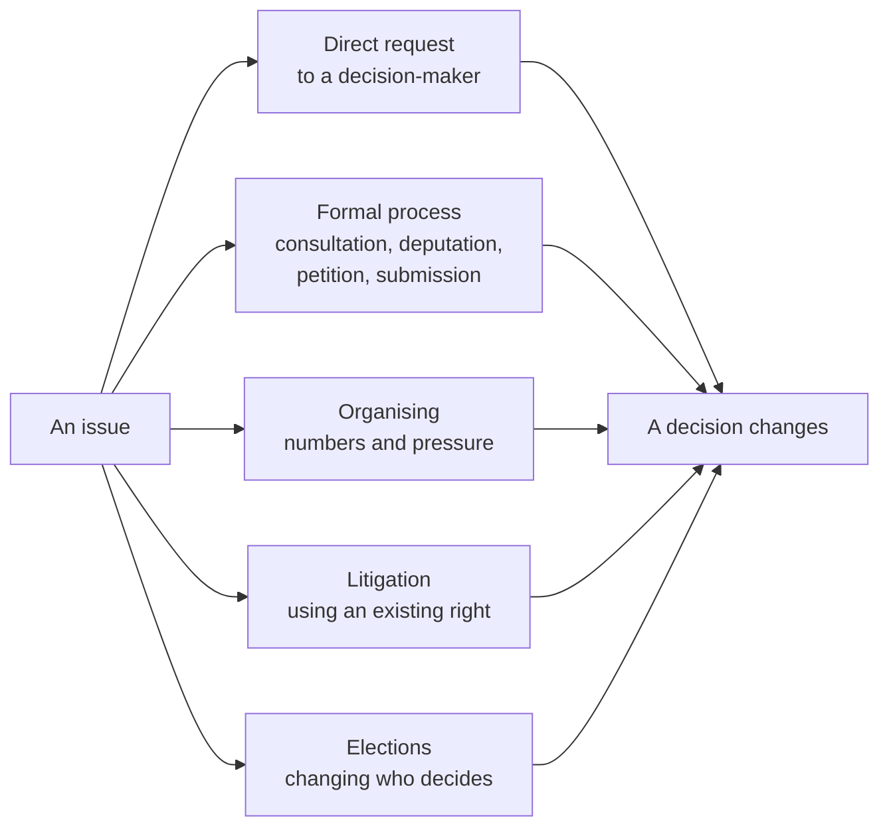

The story most people carry is that you raise awareness, public opinion
shifts, and government responds. It happens occasionally. Far more often
the change came from a route that was less visible and more boring, and
knowing the routes is the difference between an action that could work and
one that only feels like working.

## The routes, and what each actually requires

**Direct request** is the cheapest and the most underused. A councillor,
trustee, MPP or MP has staff whose job is constituent contact, and the
volume on most local issues is low enough that a well-argued letter is
genuinely read. See [[Writing to Someone in Power]].

**Formal process** works because it is scheduled. Municipalities hold
public meetings before major decisions, committees accept written
submissions, and a deputation to council is usually five minutes and
rarely oversubscribed — with your words on the public record afterwards.

**Organising** is numbers plus persistence, and it is the slowest route
by a wide margin. What works is not the demonstration; it is that a
decision-maker starts to expect the same people at the next meeting.

**Litigation** enforces a right that already exists. It is expensive and
slow and cannot create a right — but when it succeeds it binds
governments that were never going to be persuaded.

**Elections** change the decision-maker rather than the decision: you get
the whole platform, not the item you cared about.

## Rights are the mechanism, not the goal

Every route above runs on a Charter freedom being exercised. Assembly is
how a protest is lawful. Association is how an organisation exists.
Expression is how a submission, a petition and an interview are
protected. Voting is a democratic right. When people say rights are what
let Canadians change their own country, this is the concrete version of
that sentence — not a slogan, a set of tools with names.

## Choosing between them

Ask four questions of any proposed action, in this order. **Who has the
power to grant this?** If you cannot name the person or body, the action
has no target. **What is the next moment when they must decide?** A
budget vote, a consultation closing date, an election. **What would move
them?** Evidence, constituent volume, cost, legal exposure, or public
attention — usually one of those, rarely all. **What does this cost us
if it fails?** Credibility and time are real currencies, and the first is
hard to earn back.

An action that fails those four questions is not immoral. It is just
unlikely to change anything, and you would rather find that out in the
planning than in the report.

Test the routes against a real issue in
[[What Would It Take to Change This|What Would It Take to Change This?]] before choosing one for
[[The Civic Action Project]].

%%curriculum-start%%
## Curriculum connection

![[B3.3]]

![[C2.2]]
%%curriculum-end%%
