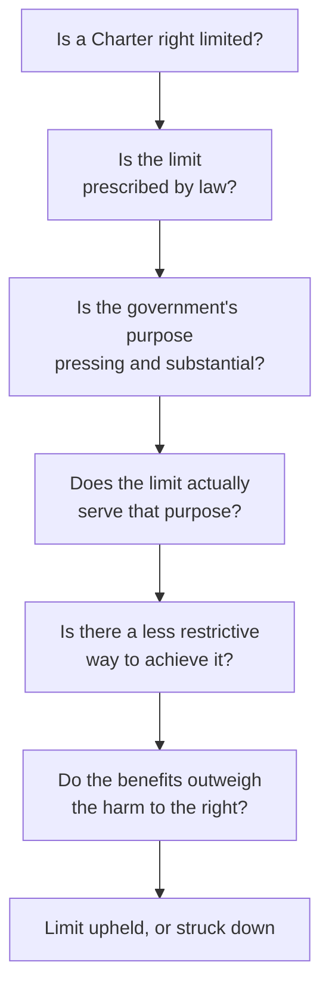

**The question:** section 1 of the Charter says rights may be limited by
what can be "demonstrably justified in a free and democratic society."
Who should get to decide when that test is met — judges, or the
legislature the voters elected?

This is the oldest argument in Canadian constitutional politics and it
does not have a settled answer. Both sides are held by serious people,
and the section 33 override exists because the framers could not settle
it either.

## The reasoning a court goes through

Bring one law you think should survive that sequence and one you think
should not, and be ready to say which step decides it.

## Positions that genuinely conflict

**Courts should decide, because that is what rights are for.** A right
that a majority can remove whenever it wants is not a right, it is a
permission. Judges are insulated from elections precisely so they can
rule against a popular government. The people most likely to need Charter
protection are, by definition, people a majority is willing to
disadvantage.

**Legislatures should decide, because they answer to voters.** Nine
appointed judges striking down a law passed by an elected assembly is a
transfer of power away from citizens. Section 33 is the democratic answer
— it is in the Charter on purpose, it expires after five years, and a
government that uses it has to face voters holding the bill.

**It depends on which right.** Limits on expression in a hate speech case
and limits on liberty in a public health emergency are not the same kind
of question, and one rule for both flattens the difference.

**The real question is evidence.** Section 1 asks a government to
demonstrate. Whether courts hold governments to that standard, and
whether governments bring real evidence rather than assertion, matters
more in practice than which institution has the last word.

## Ground rules for this one

Disagreement here often tracks something people believe strongly and
learned at home. Argue about the reasoning, not about who holds it, and
apply the same standard to a law you like and a law you do not — that
consistency is the whole test. [[Our Working Agreement]] applies in full.

Then use it: [[Whose Rights Win|Whose Rights Win?]] takes a real case through the same
steps, and [[The Rights Case]] is where the argument is marked.

%%curriculum-start%%
## Curriculum connection

![[B3.1]]

![[B3.4]]

![[A2.2]]
%%curriculum-end%%
