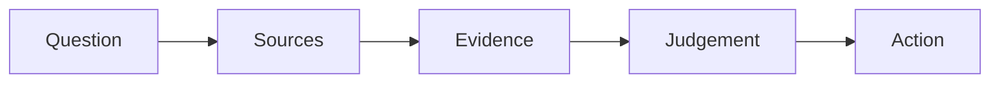

A tour of what these pages can hold — partly so you can read them, partly
so a teacher taking this course over can write them.

## Tables

| Concept of political thinking | The question it asks |
| --- | --- |
| Political significance | Why does this matter, and to whom? |
| Political perspective | What does this look like from where they stand? |
| Stability and change | What is being kept, and what is being altered? |
| Objectives and results | What was it meant to do, and what did it do? |

A link inside a table cell needs its pipe escaped, or the cell breaks:
write `[[Court Decisions\|read the reasons]]` and it renders as
[[Court Decisions\|read the reasons]].

## Callouts

> [!tip] A tip
> Something to try before the next class.

> [!warning] A warning
> Used when getting this wrong has a cost.

A callout with a `-` after its type starts folded:

> [!success]- A folded block
> Usually a question to try first, so you get to think before you read an
> answer. You just opened it, which is the demonstration.

## Diagrams

Diagrams are written as text, so a teacher can edit them in place:



## Checklists

- [ ] Notebook entry written
- [ ] Source checked against the original

> [!warning] These do not save
> A checkbox here is printed, not interactive. Nothing is recorded and
> the site does not know who you are. Copy the list into your notebook.

## Footnotes

Useful for an aside that would interrupt the sentence.[^cite]

[^cite]: Citations in this course name the producer, the title, the date,
and where you found it — enough that a reader could reach the same
document. A legal citation adds the neutral citation, as in *2015 SCC 5*,
and a bill adds its number and the legislature.

A dollar sign starts a mathematical expression, so it has to be escaped:
write `\$14` to get \$14. That comes up here more than you would expect,
because budgets are made of dollar signs.

## What this course does not use

The site can typeset mathematics and highlight program code, and this
course does neither. Shown once so you know they exist:

$$\text{turnout} = \frac{\text{ballots cast}}{\text{electors on the list}}$$

```python
print("not used in this course")
```

Your work here is made of documents, argument, and citation. If you meet
these two in another course, it is the same site doing it.
