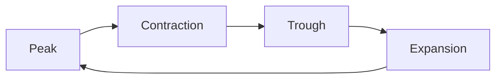

Economies do not grow smoothly. Output rises for a stretch, stalls, falls
back, and rises again, and the pattern repeats without ever repeating
exactly. The cycle model names four positions so that you can say where
you think the economy is and be argued with.

At a **peak**, output and employment are high and capacity is stretched.
In a **contraction**, spending and production fall and unemployment
rises; a deep, prolonged one is called a depression. The **trough** is
the turning point, which nobody announces at the time. In an
**expansion**, output recovers and hiring resumes. The dates come later.

## What actually dates a recession in Canada

Not the "two consecutive quarters of negative GDP" rule you have heard.
That is journalistic shorthand, not a definition. The C.D. Howe
Institute's Business Cycle Council dates Canadian cycles by the depth,
duration and breadth of a decline across output and employment together.

Which means you can genuinely argue the current position. Real GDP fell
0.2% in the fourth quarter of 2025 and was flat at 0.0% in the first
quarter of 2026, released 29 May 2026 from Table 36-10-0104-01. That is
not two negative quarters, and not an expansion either. Making the case
either way, with the labour market figures beside the output, is the work.

## How institutions respond

The Bank of Canada moves the policy rate. Governments change spending and
taxes, and can reach for public-private partnerships or regulation. Crown
corporations and industry associations respond in their own ways,
sometimes to moral suasion rather than to law. Watch the timing as
closely as the instrument: policy acts on an economy that already moved.

The model behind the movement is in [[Aggregate Supply and Demand]]; the
indicators are in [[Measuring an Economy]].

%%curriculum-start%%
## Curriculum connection

![[D1.1]]

![[D2.3]]
%%curriculum-end%%
