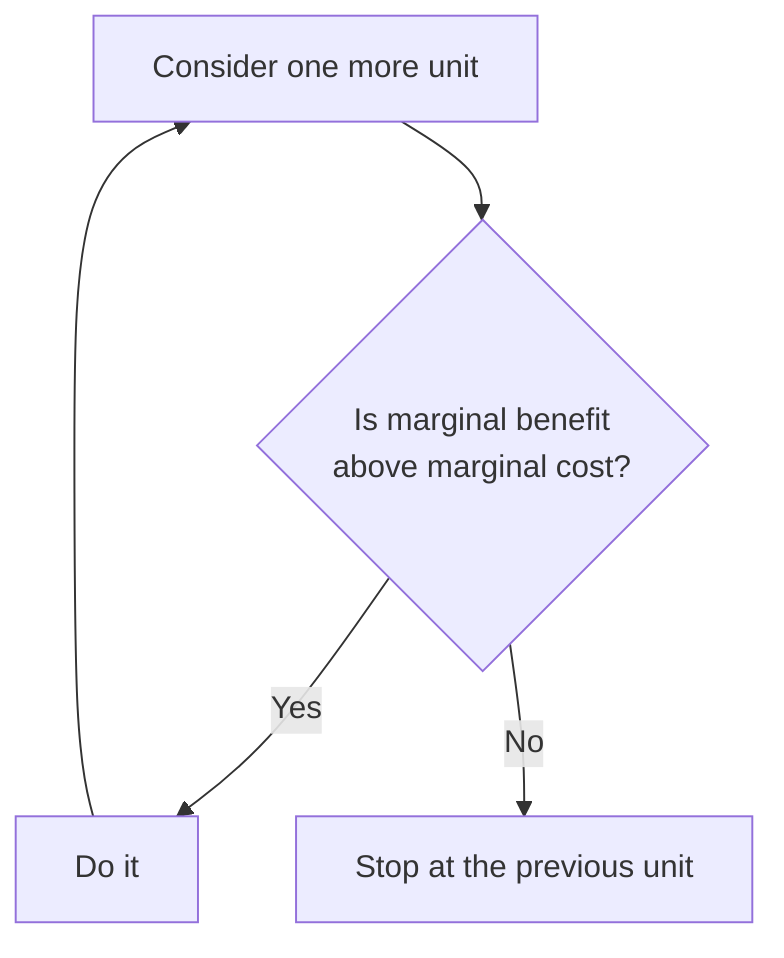

Almost no real decision is all-or-nothing. You are rarely choosing between
studying and not studying, or between a firm producing and not producing.
You are choosing whether to do *one more* — one more hour, one more shift,
one more unit — and the question that settles it is whether the benefit of
that one more exceeds what it costs you.

That is marginal thinking, and it is why averages mislead. A high average
across four hours of study tells you nothing about the fifth hour. That
hour has its own benefit, usually smaller than the fourth, and its own cost
— whatever you gave up to sit there. See [[Opportunity Cost]].

## The loop

The loop matters more than any single pass through it. Because each extra
unit typically brings less benefit and costs more to produce, the loop ends
by itself. A firm deciding output runs exactly this comparison, with the
cost side worked out in [[Costs and the Firm]]; so does a consumer deciding
how many to buy, which is why demand curves slope the way they do.

## Sunk costs do not enter the comparison

A cost you have already paid and cannot recover is sunk. It is part of
neither the marginal benefit of continuing nor the marginal cost, so it has
no business in the decision. The concert ticket you cannot resell, the four
hours already spent on an essay approach that is not working, the equipment
a firm has already bought — none of them argue for continuing. The only
question is whether the next step is worth what the next step costs.

People find this genuinely difficult. Noticing that you are defending a
decision because of what it already cost you is one of the more useful
habits this course can give you.

%%curriculum-start%%
## Curriculum connection

![[B1.4]]

![[B2.3]]
%%curriculum-end%%
