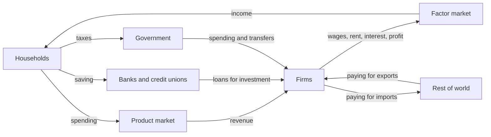

The circular flow is a map of who pays whom. Households own the labour,
land and capital; firms hire those and produce; the money that leaves one
hand arrives in another. The reason to draw it is the discipline it
imposes — every flow has to land somewhere.

## Following the money round

Two markets connect the pair. In the product market, households spend and
firms take revenue. In the factor market, firms pay wages, rent, interest
and profit, and that payment is household income. In the two-sector
version the loop closes exactly: income equals spending equals output.

A real economy leaks. Saving, taxes and spending on imports leave the
loop; investment, government spending and export earnings come back in.
When leakages and injections match, income holds steady; when injections
run ahead, income rises. Fiscal policy is the deliberate use of that
tax-and-spending pair, and [[Reading a Budget]] shows where it is set out.

Banks, credit unions and near banks sit at the single join where saving
becomes investment, which is why they belong on the diagram: narrow that
channel and the leak is never refilled. What the model leaves out is time.
Nothing accumulates here, and nothing in it sets a price level, so for
output and prices together you need [[Aggregate Supply and Demand]].

%%curriculum-start%%
## Curriculum connection

![[D1.1]]

![[D2.4]]

![[D3.3]]
%%curriculum-end%%
