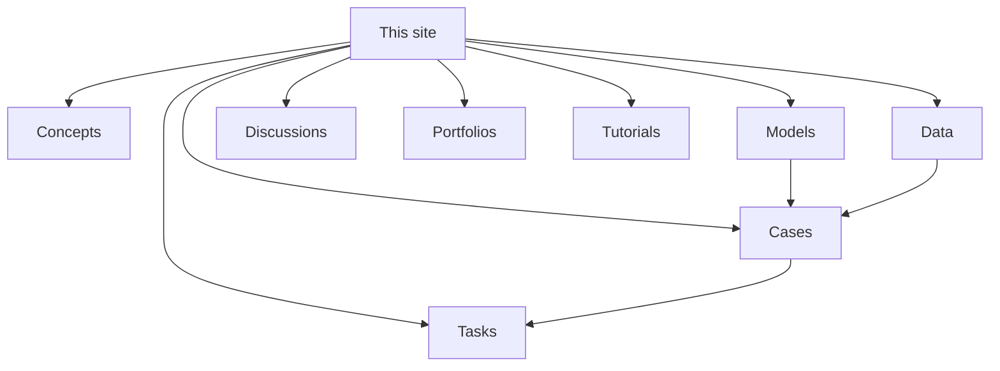

This site is the course: the ideas, the models, the evidence, and the work
you hand in. Which folder a page sits in tells you what kind of thing it is.

## What belongs in each

- **Concepts** — the ideas, stated cleanly: scarcity, externalities,
  inflation, inequality. Read after the class that met the idea.
- **Models** — ways of reasoning: supply and demand, elasticity, the
  production possibilities curve, comparative advantage.
- **Data** — where Canadian evidence comes from, and how to read it.
- **Cases** — live Canadian questions where models and evidence meet.
- **Discussions** — the contested questions, and how to prepare for one.
- **Tasks** — assessed work, each with what earns the marks.
- **Portfolios** — your own running record across the term.
- **Tutorials** — how to do the things this course asks of you.
- **Setup** and **Style** — how the class runs, and how this site works.

## Why Models and Data are separate folders

This division is deliberate. **A model is a way of reasoning; a dataset is
evidence.** They answer different questions and they fail in different ways.

A model tells you what to expect if certain assumptions hold, and it can be
elegant, internally consistent, and describe nothing happening in Canada this
year. Data tells you what actually occurred, with a date and a table number
attached, and cannot on its own tell you why. A student who collapses the two
argues from a curve instead of from the economy, and it shows: the paper says
what the model requires rather than what the country did. So the arrows above
run one way — models and data both feed the cases, and the cases feed the
tasks.

[[Using This Site]] covers navigation and search. [[What This Site Can Do]]
is the tour of the features these pages can hold.
