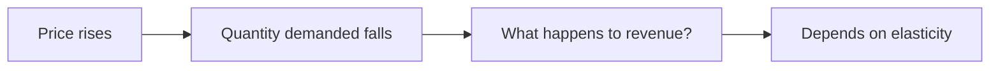

A tour of what these pages can hold — partly so you can read them, and
partly so a teacher taking this course over knows what is available.

## Tables

Most economics is a comparison, so most pages have a table.

| Question | The tool | What it gives you |
| --- | --- | --- |
| Why did the price move? | [[Supply and Demand]] | A direction, and which side shifted |
| By how much did quantity move? | [[Elasticity\|how much quantity moves]] | A number, with a sign |
| What did the choice cost? | [[The Production Possibilities Curve]] | The alternative given up, drawn |

A link in a table cell needs its pipe escaped or the cell breaks in half.
Written `[[Elasticity\|how much quantity moves]]`, with a backslash before
the pipe, it renders as [[Elasticity\|how much quantity moves]].

## Callouts

> [!tip] A tip
> Something you can act on immediately.

> [!warning] A warning
> Something that goes wrong reliably, so it is worth saying loudly.

> [!note] A note
> Context that would otherwise interrupt the paragraph.

A `-` after the type starts the callout folded — how answers stay hidden:

> [!success]- What elastic demand means for revenue
> A price rise cuts quantity by proportionally more, so total revenue
> falls. You just clicked it, which is the whole demonstration.

## Diagrams

Diagrams are written as text, so they need no drawing program:



## Checklists

- [ ] Figure carries its table number
- [ ] Figure carries its release date

> [!warning] These boxes save nothing
> A checkbox here is printed, not interactive. Clicking does nothing, no
> state is recorded, and the site does not know who you are. Copy the list
> into your notebook if you want to work through it.

## Footnotes

Useful for a source citation that would otherwise clog the sentence.[^cpi]

[^cpi]: Statistics Canada, *Consumer Price Index, June 2026* — released
20 July 2026, Table 18-10-0004-01. CPI rose 2.8% year over year.

## Money

Amounts are ordinary text with an escaped dollar sign — Ontario's general
minimum wage is \$17.60 an hour, rising to \$17.95 on 1 October 2026.

> [!warning] The backslash is not optional
> Without it, `$` opens a mathematics span and everything up to the next
> dollar sign vanishes into it. Write `\$17.60`, always.

## Mathematics

This course uses a little, so here is the honest version. Display maths
goes in a `$$` block, and it must be a **single physical line**:

$$E_d = \frac{\%\,\Delta Q_d}{\%\,\Delta P}$$

Break it across two lines and it comes apart at markdown's seams. And a
currency amount never goes inside a maths span — dollars stay in the prose.

## What this course does not use

The site can highlight program code, and this course never asks for any.
Shown once so you know the capability is there:

```python
def percent_change(old, new):
    return (new - old) / old * 100
```

That belongs to computer science. Here you would do the same arithmetic in
a spreadsheet and spend the saved time on where the two figures came from.
