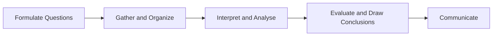

Economics has a method, and the Ministry prints it in the Economics
introduction to *The Ontario Curriculum, Grades 11 and 12: Canadian and
World Studies, 2015* — five components, in this order. They are named
there rather than inside any single expectation of this course.

Read those arrows as a first pass, not as a rule. Real inquiry doubles
back: the evidence you gather changes the question you should have asked,
and an interpretation that will not hold sends you looking for better
sources. Going back is not failure — a student who never returns to an
earlier component has usually decided the answer first.

Gather and Organize carries a demand that is easy to skip. Your sources
have to reflect a range of perspectives, and a Statistics Canada release,
a bank's forecast and an advocacy brief are not interchangeable.

## Three kinds of question

- **Factual** — what was Canada's unemployment rate in July 2026? It was
  6.4 per cent, Table 14-10-0287-01, released 7 August 2026.
- **Comparative** — how does Canadian labour productivity compare with
  American? Statistics Canada's *Economic and Social Reports*, March 2026,
  puts the gap about 26 per cent wider than it was in 2000.
- **Causal** — why did food purchased from stores rise 3.9 per cent year
  over year in June 2026, Table 18-10-0004-01, released 20 July 2026?

The three are not a ranking; a causal question you cannot answer is worth
less than a factual one you can. Judge what you find with
[[Judging an Economic Claim]], and start at
[[Where Canadian Economic Data Lives]].

%%curriculum-start%%
## Curriculum connection

![[A1.1]]

![[A1.2]]

![[A1.6]]
%%curriculum-end%%
