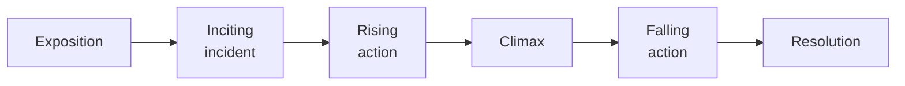

Plot is what happens. Structure is the order a writer chose to reveal it
in — and structure is where the argument usually lives.

## The shape most stories use

Useful as a description; misleading as a rule. The questions worth asking
are structural rather than definitional:

- **Where does the writer start?** As late as possible, usually. What was
  left out?
- **What is withheld, and for how long?** Suspense is an arrangement, not
  an event.
- **What order are we told things in, and why not chronological?**
- **Where is the midpoint**, and what changes there? In a lot of texts
  the middle is where the protagonist stops reacting and starts choosing.

## When the writer tells you the ending first

*Romeo and Juliet* opens with a Prologue that gives away the entire plot
in fourteen lines. That is not a mistake and it is not carelessness — it
converts the play from a question of *what happens* into a question of
*how it happens*, which is a different and more uncomfortable kind of
attention. Watch what it does to your reading of Act 1.

## Structures worth naming

| Structure | What it does |
| --- | --- |
| **Linear** | Simple, and lets cause and effect land |
| **Frame narrative** | A story inside a telling; raises the question of who is telling and why |
| **In medias res** | Starts in the middle; forces the reader to catch up |
| **Parallel plots** | Two lines that comment on each other |
| **Circular** | Ends where it began, changed — the change is the point |

> [!question] Worth arguing about
> If you know the ending of a story before it starts, can it still be
> suspenseful? Argue it with the Prologue, then with a film you have
> rewatched.

%%curriculum-start%%
## Curriculum connection

![[B2.1]]

![[B2.2]]
%%curriculum-end%%
