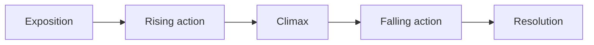

The flash fiction you read today did something a page-long story has to
do efficiently: it introduced a problem, let it get worse, and resolved
it — all in a few hundred words. That compressed shape is the same shape
longer stories use, just stretched out. This page names the two ideas
sitting underneath it: what conflict actually is, and how a plot arranges
itself around it.

## What conflict is

Conflict is not just "an argument" or "a fight." It is whatever a
character wants and cannot easily get. Four broad kinds cover most of
what you will read this year:

- **Person versus person** — one character's goal collides with another's.
- **Person versus self** — the obstacle is internal: fear, guilt, a
  divided loyalty.
- **Person versus society** — a character is at odds with a rule,
  expectation, or institution.
- **Person versus nature** — the obstacle is the physical world itself.

A story can run more than one of these at once, and often the internal
conflict is what actually resolves, even when the external one is what
drives the plot on the surface.

## The shape a plot takes

Most short fiction — including today's — follows some version of the
same arc, usually credited to the nineteenth-century critic Gustav
Freytag:

**Exposition** sets up who and where. **Rising action** is the conflict
getting harder to avoid. The **climax** is the moment the conflict can no
longer be delayed — the turning point the whole story has been building
toward. **Falling action** shows the consequences starting to settle, and
the **resolution** is where the story leaves the character once the dust
has cleared.

Not every writer uses all five stages evenly. A very short piece, like
today's, often compresses exposition down to a sentence and spends almost
everything on the climax. Watch for that compression — it is a choice,
and it tells you what the writer thought was actually worth your time.

## Where this goes next

You will use this shape constantly this term, and you will also watch
writers bend it: [[Happy Endings]] takes the resolution and multiplies it
six different ways, which only makes sense once you know what a
resolution is supposed to do in the first place. Pair this page with
[[Character and Characterization]] — conflict is very often how a
character gets revealed.

%%curriculum-start%%
## Curriculum connection
![[B2.1]]
%%curriculum-end%%
