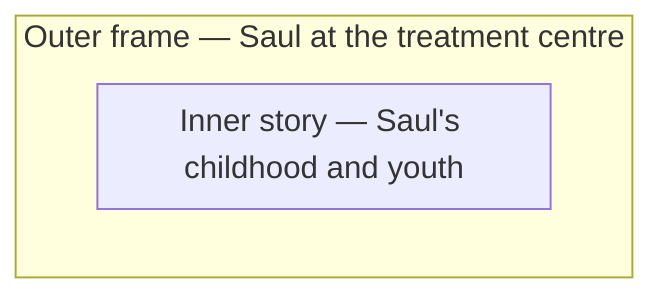

[[Indian Horse]] does not open with Saul's childhood. It opens with an
adult Saul, in a treatment centre, being told that writing his story down
might help him heal — and the story you have been reading ever since is
the result of that instruction. Everything that happens to young Saul is
being told to you by an older Saul who already knows how it ends. That
structure has a name.

## What a frame narrative is

A **frame narrative** wraps an outer story around an inner one. The
outer frame establishes who is telling the story, from where, when, and
often why — and the inner story is what that framing narrator actually
tells.

You never fully leave the outer frame, even while you are reading the
inner story: it is *why* the inner story is being told at all, and it
shapes how you are meant to receive it.

## Why Wagamese chooses this shape

A frame narrative changes what a novel can do. Because you know from the
opening pages that Saul survives to tell this story, from a place of
recovery, the novel is not asking "will he make it?" It is asking
something harder: "what did surviving cost him, and what does telling
the story finally let him put down?" The frame is what makes that second
question possible — without it, the novel would just be a chronology of
things that happened to a boy. With it, the novel becomes about the act
of telling itself: why Saul has stayed silent for so long, and what
changes when he stops.

Watch for where the narration briefly steps back into the outer frame — a
short passage set at the treatment centre, breaking into the flow of the
inner story. Those moments are rare, and each one is a signal about how
close to the surface a particular memory sits.

%%curriculum-start%%
## Curriculum connection
![[B2.1]]
%%curriculum-end%%
