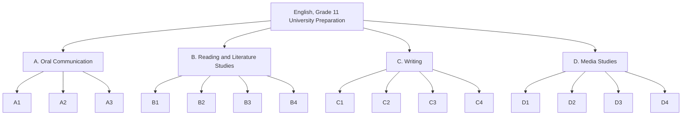

Every expectation this course addresses, grouped by strand. See [[About These Expectations]] for the citation and how to read a code.

![[A1. Listening to Understand]]

![[A1.1]]

![[A1.2]]

![[A1.3]]

![[A1.4]]

![[A1.5]]

![[A1.6]]

![[A1.7]]

![[A1.8]]

![[A1.9]]

![[A2. Speaking to Communicate]]

![[A2.1]]

![[A2.2]]

![[A2.3]]

![[A2.4]]

![[A2.5]]

![[A2.6]]

![[A2.7]]

![[A3. Reflecting on Skills and Strategies]]

![[A3.1]]

![[A3.2]]

![[B1. Reading for Meaning]]

![[B1.1]]

![[B1.2]]

![[B1.3]]

![[B1.4]]

![[B1.5]]

![[B1.6]]

![[B1.7]]

![[B1.8]]

![[B2. Understanding Form and Style]]

![[B2.1]]

![[B2.2]]

![[B2.3]]

![[B3. Reading With Fluency]]

![[B3.1]]

![[B3.2]]

![[B3.3]]

![[B4. Reflecting on Skills and Strategies]]

![[B4.1]]

![[B4.2]]

![[C1. Developing and Organizing Content]]

![[C1.1]]

![[C1.2]]

![[C1.3]]

![[C1.4]]

![[C1.5]]

![[C2. Using Knowledge of Form and Style]]

![[C2.1]]

![[C2.2]]

![[C2.3]]

![[C2.4]]

![[C2.5]]

![[C2.6]]

![[C2.7]]

![[C3. Applying Knowledge of Conventions]]

![[C3.1]]

![[C3.2]]

![[C3.3]]

![[C3.4]]

![[C3.5]]

![[C3.6]]

![[C3.7]]

![[C4. Reflecting on Skills and Strategies]]

![[C4.1]]

![[C4.2]]

![[C4.3]]

![[D1. Understanding Media Texts]]

![[D1.1]]

![[D1.2]]

![[D1.3]]

![[D1.4]]

![[D1.5]]

![[D1.6]]

![[D2. Understanding Media Forms, Conventions, and Techniques]]

![[D2.1]]

![[D2.2]]

![[D3. Creating Media Texts]]

![[D3.1]]

![[D3.2]]

![[D3.3]]

![[D3.4]]

![[D4. Reflecting on Skills and Strategies]]

![[D4.1]]

![[D4.2]]
