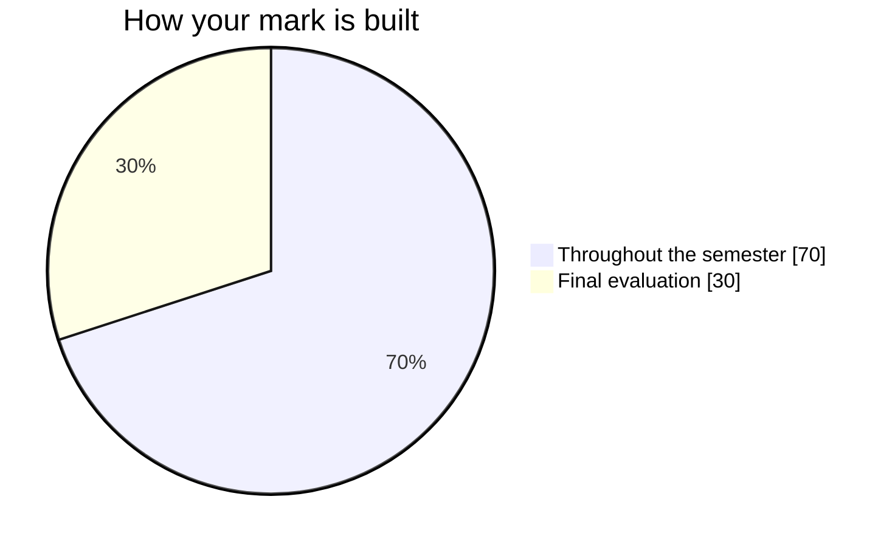

Your final mark is built from two pieces, not from adding up every single
thing you ever hand in.

## Seventy: the semester's work

Seventy per cent comes from the five tasks you complete across the four
units — [[Two Stories, One Thread]], [[The Weight of the Ice]], [[Staging
the Unseen]], and [[Your Canada, Your Story]] — the fifth being the
individually-marked companion pieces that travel alongside a group task
(Unit 3's rhetorical analysis, for instance). Where a task is worked on in a
group — Unit 3's scene study — the group product is not what gets marked:
every student is evaluated individually, on their own director's note and
their own performed role, never on a shared score.

This mark leans toward your **most consistent** level of achievement, with
more weight given to your **most recent** work — so a rough Unit 1 essay
that you clearly outgrew by Unit 4 does not sit at the centre of your final
grade the way your later work does.

## Thirty: the final evaluation

The last thirty per cent is a single three-hour exam near the end of the
course — an unseen passage to analyze and an essay to write under exam
conditions. It is deliberately built to draw on everything the semester
practised, not just the last unit: the close-reading skills from Unit 1, the
essay structure from Unit 2, the attention to language and rhetoric from
Unit 3, and the persuasive reading from Unit 4 all show up in it.

## What "evidence" means here

A mark is never built from products alone. Three kinds of evidence count:

- **What you make** — the essay, the recording, the written analysis.
- **What I watch you do** — a rehearsal, a research period, a conference,
  the way a scene actually gets performed.
- **What you say** — in a checkpoint conversation, a seminar, a conference.

The second and third kinds are easy to lose track of, so every task page in
this course names, in a hidden teacher note, exactly where in that task
those two kinds of evidence are available to gather. You will not see that
note — it is a reminder for me, not an assignment for you.

## What never becomes part of this mark

- **A classmate's opinion of your work, or your own.** Self- and
  peer-assessment (see [[Judging Your Own Work]]) sharpen your judgement —
  they are never averaged into your grade.
- **Ongoing homework.** Reading you do at home to get ready for the next
  class is practice, not evidence — every piece of writing that carries a
  mark is written, at least in its evaluated form, in class, on a day the
  class page names.
- **Learning skills and work habits.** Responsibility, organization,
  independent work, collaboration, initiative and self-regulation are real,
  and they are reported on your report card as E/G/S/N — but separately.
  They do not move this percentage in either direction. This course has no
  expectation that is itself about a habit, so there is no exception to
  that rule here.

## The four kinds of thinking this mark reflects

Every task draws on some mix of these, weighted the way this course
actually asks for them — university-prep English leans hardest on the
middle two:

- **Knowledge and Understanding** — do you know what happened in the text,
  and what the terms mean.
- **Thinking** — can you build an argument, choose evidence, and connect
  ideas the text does not connect for you.
- **Communication** — is it clear, organized, and in the right form for who
  is reading or listening to it.
- **Application** — can you take a skill you built on one text and use it
  on a text, or a form, you have not practised it on before. Unit 4's move
  from literary rhetoric to media rhetoric is where this course asks for
  that most directly.
