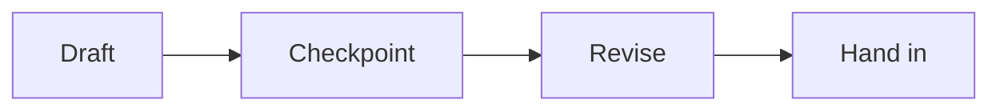

A quick tour of what this site can render, so nothing on a real page
surprises you the first time you meet it.

## Callouts

A plain callout draws attention to something without making you read a wall
of text:

> [!tip] Callouts come in several colours
> This one is a tip. Warnings, notes, and success callouts each have their
> own colour, so you can tell at a glance what kind of thing you're reading.

Some callouts start folded, so the page stays short until you want the
detail:

> [!success]- Click this line to expand it
> This is what a folded callout looks like open. Task pages sometimes use
> this shape for a worked example, or for detail you only need if you're
> stuck.

## Tables

Tables are how a lot of task pages present success criteria — one row per
quality, one column for what it looks like:

| Quality | What it looks like |
|---|---|
| Clear | A reader who has not read the text yet could follow your argument |
| Supported | Every claim is backed by a specific line or moment from the text |
| Organized | Each paragraph does one job, and the order makes sense |

## Checklists

A checklist looks like this:

- [ ] Read the assigned section
- [ ] Bring your reading journal
- [ ] Note one question you'd ask the writer

**These boxes are read-only** — clicking one does nothing, and nothing is
saved. Treat a checklist as something to copy into your own notebook or read
down before handing something in, not as an app you tick things off in.

## Footnotes

A page can drop in a side note without breaking the sentence it belongs
to[^1] — useful for a citation, or for something true but not essential to
follow the main point.

## Diagrams

Some pages use a small diagram where a picture genuinely says something
prose would take a paragraph to say:

## What this course does not use

This site can also render mathematics (KaTeX) and chemical formulas
(mhchem) — neither shows up anywhere in this course, because English has no
use for either. If you ever see a page from a different subject with an
equation on it, that is why it looks different from anything here.

[^1]: Like this — a citation detail, or an aside, that would clutter the
    sentence it's attached to if it stayed in the main text.
