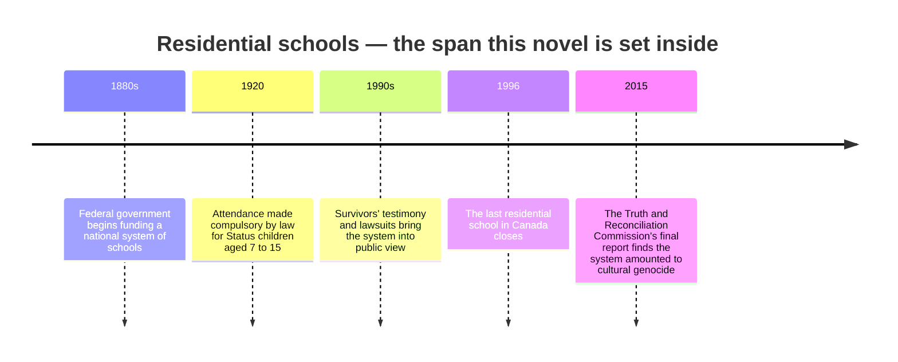

Tomorrow the class starts *Indian Horse*, which follows Saul Indian Horse
through a residential school. Before that, we need a shared, factual sense
of what a residential school actually was — not as background trivia, but
as the real history the novel is built on.

## What the schools were

Beginning in the 1880s, the Canadian government funded a national system
of schools, most run by churches, whose explicit purpose was to separate
Indigenous children from their families, languages, and cultures. From
1920, attendance was made compulsory by law for Status children aged 7 to
15. An estimated 150,000 First Nations, Inuit, and Métis children passed
through this system before the last school closed in Saskatchewan in 1996
— within the lifetime of people teaching in schools today.

The Truth and Reconciliation Commission spent six years documenting what
happened inside these schools, directly from survivors. Its final report,
released in 2015, confirmed widespread abuse and documented at least 3,200
deaths of children in care — a number the Commission itself said was
likely a significant undercount, since many schools kept incomplete
records or none at all.

## Why the novel matters here

*Indian Horse* is fiction, but the school Saul attends, St. Jerome's, is
not invented out of nothing — it reflects what survivors have described.
Reading it well means holding two things at once: this is one character's
story, imagined by a writer, and it is also true to a history real people
lived through, some of whom are still alive to tell you about it
themselves.

## Building this unit's agreement

[[How We Talk About Hard Things]] is the general agreement the whole class
built together in September. Today, before we open this novel, we build
this unit's own version of it out loud, as a class — what it means to read
generously, what it means to disagree carefully, and what to do if a
passage becomes genuinely too much on a given day. That conversation
happens now, in the room, not on this page, because it has to be built by
the people actually in it.

> [!success]- If you want to read more before tomorrow
> The National Centre for Truth and Reconciliation (nctr.ca) publishes
> survivor testimony and the Commission's full findings directly. Nothing
> on this page is a substitute for hearing that history in survivors' own
> words.
