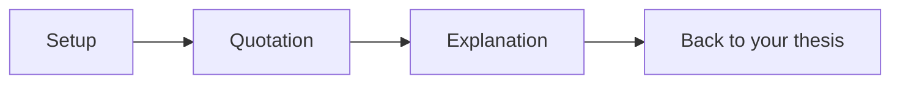

A quotation dropped into a paragraph with nothing around it asks your
reader to do your job for them — to figure out why it's there and what it
proves. A quote sandwich does that work for them, every time.

## The three parts of a sandwich

- **Setup** — one sentence that tells your reader who is speaking, or what
  moment this is, before the quotation arrives.
- **Quotation** — the exact words, doing work your own sentence couldn't
  ([[Writing About Literature]] covers when a quotation earns its place at
  all).
- **Explanation** — what the quotation shows, in your own words, connected
  back to the claim your paragraph is making.

Skip the setup and your reader is disoriented. Skip the explanation and
you've made them do your analysis for you.

## What it looks like

> [!fail] Bread missing
> The narrator realizes what's happening to her. "She's only a girl."
> This shows the theme of gender roles.
>
> The quotation just sits there. We don't know who says it, and "shows the
> theme of gender roles" isn't an explanation — it names a topic without
> saying what the quotation actually does.

> [!success] Full sandwich
> When her father dismisses her competence with a single line — "she's
> only a girl" (Munro 15) — the narrator hears, for the first time, the
> category she's already been sorted into. The line isn't cruel on
> purpose; that's what makes it land. Nobody in her family thinks they're
> teaching her anything.
>
> Setup names who's speaking and why it matters here. The quotation is
> short — three words do the work. The explanation goes further than
> restating the line: it says what the line reveals and adds a second
> observation the quotation alone doesn't state outright.

## Choosing what to quote

Not every piece of evidence needs to be a direct quotation. A short phrase
that captures exact word choice earns quotation marks; a plot event you're
referencing to build your argument can usually be paraphrased instead, and
paraphrase moves your paragraph along faster. Ask: does the *exact wording*
matter here, or only the *fact* that this happened? Only the first case
needs the sandwich.

## The punctuation that makes it work

A quotation that isn't introduced or punctuated correctly undercuts the
sandwich even when the setup and explanation are strong — a dropped quote
with no lead-in sentence, a missing comma before the closing quotation
mark, a page number in the wrong place. [[Editing and Proofreading]] covers
the mechanics of introducing and punctuating a quotation correctly, and
[[MLA In-Text Citation]] covers exactly where the citation goes and what to
do when your source is a play instead of a novel.

%%curriculum-start%%
## Curriculum connection
![[C1.5]]

![[C3.3]]
%%curriculum-end%%
