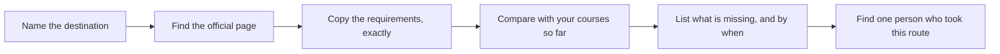

Two periods in the library or the computer room. You take one
destination you are seriously considering and find out what is actually
required to get into it, from the organisation that decides — not from a
summary, a video, or somebody's older brother.

## The route

Each box is a piece of paper at the end of it. Box F is often an email,
and it is often the most useful thing you produce.

## Official means official

The organisation that decides is the one whose page counts: the college
or university for its own programs, the trade's own governing body or
the apprenticeship program for a trade, the employer for a job, the
provincial site for financial assistance. Third-party ranking sites and
forums are useful for questions and unreliable for requirements.

Copy requirements word for word and date the copy. Requirements change
between the year you look and the year you apply, so what you are
building is a starting point you will re-check in Grade 12, not a
permanent answer.

## What to come out with

- The name of the program, employer, or trade, precisely as they write
  it.
- Its entry requirements, including any Grade 11 and 12 courses named.
- Deadlines, and what has to be true before each one.
- What the first year costs and what it pays, if either.
- Two things you could not find out, and who you would ask.

## Then compare

Do this twice, for two different destinations, and put them side by
side. Comparison is where the value is — the two options will differ on
cost, length, entry difficulty, and how reversible they are, and until
they are next to each other you are choosing on impression.

Both write-ups go into [[Your Plan So Far]], and the stronger of the two
becomes the spine of [[The Pathway Plan]].

%%curriculum-start%%
## Curriculum connection

![[B3.1]]

![[C1.1]]
%%curriculum-end%%
