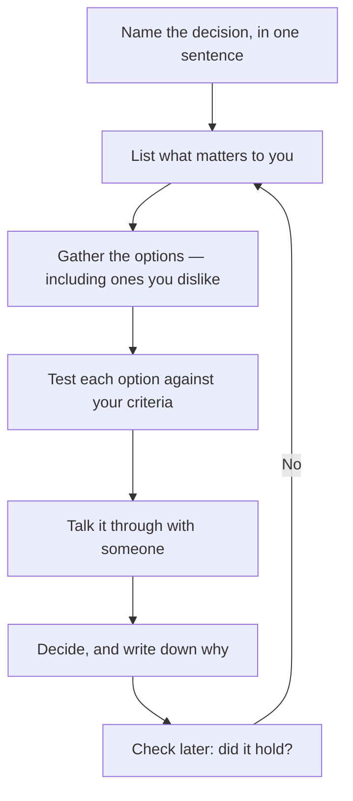

You already have a decision-making method. You have used it to pick
courses, jobs, teams, and people to spend time with. What you probably
have not done is name it — and an unnamed method cannot be improved,
because you cannot tell which part of it failed.

## The strategies worth having

- **Pros and cons.** Fast, and weak on its own, because it treats every
  line as equally important.
- **Criteria first.** Decide what matters *before* you look at the
  options, then rank the options against it. This is the one that
  survives pressure.
- **Mapping it out.** Draw the options and what each one leads to. Good
  when the consequences are what you cannot see.
- **Asking people.** A parent, a guardian, a guidance counsellor, an
  Elder or Métis Senator, a knowledge keeper, someone doing the thing
  already. Different people will disagree, and that is the value.
- **Waiting on purpose.** Deciding when you will decide, rather than
  drifting past it.

## A process you can actually run

The last two boxes are the ones people skip. Writing down *why* takes
two minutes and is the only way to find out later whether your reasoning
was sound or you were just lucky.

## Why some decisions are hard

Difficulty is usually one of three things: the criteria conflict, the
information is missing, or someone whose opinion matters to you wants a
different answer. Each has a different fix — rank the criteria, go find
the information, or have the conversation. Naming which one you are in
is most of the work.

Postponing is a real option, and it has costs as well as benefits. More
time can mean a better decision; it can also mean the deadline decides
for you, which is the one outcome where nothing you thought about
mattered.

You will run this process for real in [[The Decision]].

%%curriculum-start%%
## Curriculum connection

![[A2.1]]
%%curriculum-end%%
