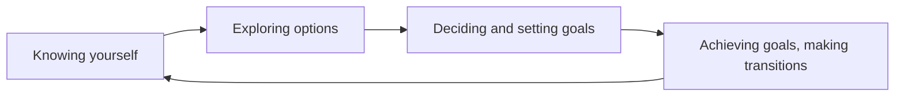

A short tour of what these pages can hold — partly so you can read them,
and partly so that a teacher taking this course over can write them.

## Tables

Most of this course is a comparison, so most pages carry a table.

| Pathway | First year | Decided by |
| --- | --- | --- |
| Apprenticeship | Paid work plus in-school training | The employer and the trade |
| College | Program of one to four years | The college's own admissions |

A link inside a table cell needs its pipe escaped, or the cell breaks in
half: write `[[Pathways After Grade 12\|the five destinations]]` and it
renders as [[Pathways After Grade 12\|the five destinations]].

## Callouts

> [!tip] A tip
> Something you can act on immediately.

> [!warning] A warning
> Something that goes wrong reliably, so it is worth saying loudly.

> [!note] A note
> Context that would otherwise interrupt the paragraph.

Adding a `-` after the type makes it start folded:

> [!question]- A folded block
> Used for questions, so that you get the chance to answer before you
> read. You have just clicked it, which is the whole demonstration.

## Diagrams

Small diagrams are written as text, so they can be edited without a
drawing program:

## Checklists

- [ ] Bring a real job posting
- [ ] Bring one number with its source

> [!warning] These do not save
> A checkbox on this site is printed, not interactive. Clicking it
> records nothing and the site does not know who you are. Copy the list
> into your own notebook if you want to work through it.

## Money

Amounts are written as ordinary text — \$5, \$1,200 — and that backslash
matters. Without it, a dollar sign can start a mathematics span and the
rest of the sentence disappears into it. This course writes very few
amounts anyway, on purpose: prices change, and the skill being taught is
looking up today's number at its source.[^numbers]

[^numbers]: Footnotes are the tidy place for a source or an aside. This
one exists to explain why almost no page here prints a dollar figure, a
tuition amount, or an interest rate.

## What this course does not use

The site can typeset mathematics and highlight program code. Neither
belongs here — your numbers live in a spreadsheet and your plan lives in
a document — but both exist if a later course needs them.
