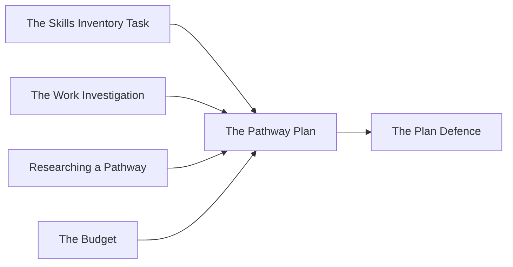

**Unit 3. The culminating task. Individual. Due in week twelve.** Four
to six pages, built from work you have already done.

Your plan for your first year after secondary school, with the two years
of secondary school that lead to it, costed with a real budget. Almost
none of this is written from scratch — it is the course, assembled and
argued.

## Where the pieces come from

## What the plan contains

1. **The destination**, named precisely — the program, trade, employer,
   or arrangement, not the category. A second destination if you are
   keeping two open, with what would decide between them.
2. **Why this one**, argued from your profile: your skills, interests,
   values, and circumstances, and how they line up. This is where the
   self-knowledge from Unit 1 has to do actual work.
3. **The secondary school pathway** — the Grade 11 and 12 courses
   required, checked against the requirements you copied from the
   source, and against what you have earned so far. Any specialised
   program that applies: co-op, OYAP, a Specialist High Skills Major, a
   dual credit.
4. **The supports** you will use, at school and in the community, named
   with how you would reach them.
5. **The steps**, in order, with the term each belongs to, from now to
   the application.
6. **The money**, summarised from [[The Budget]] — what the first year
   costs, how it is funded, and where it is tight.
7. **The risks**, and what you would do instead. Marks, money, a program
   filling, a change of mind. One line each, with a next move.

## What earns the marks

- **Precision.** Real requirements, real deadlines, real costs, sourced.
- **Coherence.** The destination follows from the profile, and the
  courses follow from the destination.
- **Feasibility.** Someone reading it could see how the first three
  steps would happen.
- **Honesty about the unknowns.** A plan that admits what is uncertain
  and says how it would be resolved beats a plan that sounds certain.
- **Revision visible.** What changed since September, and what changed
  it.

%%curriculum-start%%
## Curriculum connection

![[B3.1]]

![[B3.2]]

![[C1.1]]

![[C1.2]]
%%curriculum-end%%
