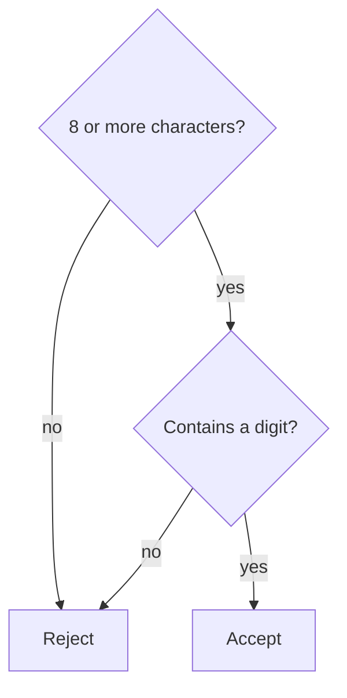

[[The Password Checker]] was the first program you wrote that made a
decision — read a password, weigh it, answer accordingly. That fork
is a conditional — how programs stop being recordings and respond.

## One question, two paths

```python
password = input("Choose a password: ")
if len(password) >= 8:
    print("Long enough.")
else:
    print("Too short — aim for 8 or more.")
```

`if` asks a yes-or-no question: yes runs the first block, no runs the
`else` block. Exactly one of the two paths ever happens.

## More than two paths

`elif` — "else if" — chains more questions, checked top to bottom:

```python
if len(password) >= 12:
    print("Strong.")
elif len(password) >= 8:
    print("Acceptable.")
else:
    print("Too short.")
```

Order matters: Python takes the *first* yes and skips the rest.

## The operators that ask the questions

Comparisons produce the yes or no: `==`, `!=`, `<`, `>`, `<=`, `>=`.
Booleans combine answers — `and` (both), `or` (either), `not` (flip).
The classic trap: `=` assigns, `==` compares — see [[Spot the Bug]].

## Questions inside questions

Checks can nest — ask a second question only if the first passes:



Nesting is easy to overgrow — three deep and squinting, flatten with
`and`. Then [[Conditionals Practice]] makes the moves automatic.

%%curriculum-start%%
## Curriculum connection

![[C1.5]]

![[C2.3]]

![[C2.5]]
%%curriculum-end%%
