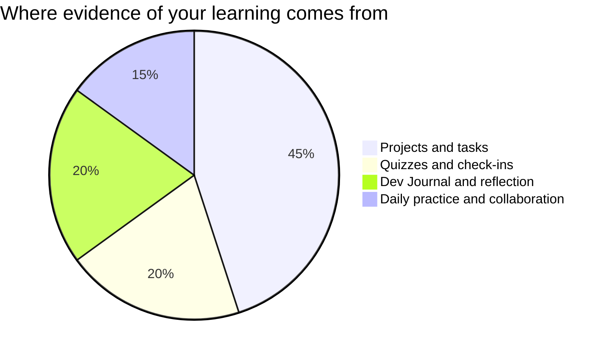

Marks in this course worry people for one wrong reason: the belief that
some people are "computer people" and the rest are doomed to watch. No
such split exists — reading code, writing code, and reasoning about
technology are learned skills, and you are marked on **process, growth,
and communication**, all inside your control.

## Where evidence comes from

**Projects** are the pages in Tasks — each lists its success criteria
before you start, phrased as things an observer could see in your work.
A program that runs but nobody can read scores lower than a readable
program with an honest known-bug list, because
[[Writing Good Comments|communication]] is most of the discipline.

**Quizzes** are short, frequent, low-stakes, and re-attemptable after
new learning — they exist to find out what needs work, not to close the
book on it.

**Reflection** is your [[Dev Journal]]. It is where a broken build turns
into evidence of learning — often the strongest evidence you have.

**Daily practice** is the small stuff done consistently: warm-up
predictions, driving and navigating fairly in pairs, the question that
helped a neighbour's debugging.

> [!important] Broken programs are never penalised as broken
> Version one of everything crashes. The mark follows where your work
> ends up and how visibly you got there — the journal and your comments
> are how "visibly" happens.

If a mark ever surprises you, ask — the criteria on each task page are
the whole story, and [[Getting Help]] lists the ways to reach me.

%%curriculum-start%%
## Curriculum connection

![[A1.1]]
%%curriculum-end%%
