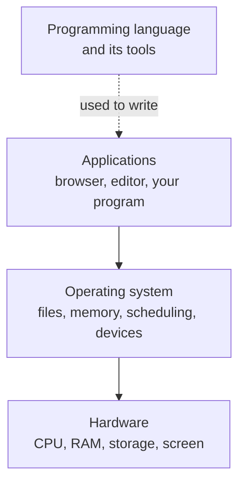

Three words get used as though they were one thing — software. They do
different jobs, and the difference explains who is responsible when
something breaks.

An **operating system** manages the machine: it decides which program
gets the processor next, hands out memory, owns the files, and speaks
to the hardware so that no one else has to. macOS, Windows, Linux,
Android, iOS.

A **programming language** is a notation for writing instructions, plus
the tools that carry them out. Python, C, Java, JavaScript. A language
is not a program you run; it is the means by which programs get
written.

An **application** is a program written for a person to use to do
something: a browser, a photo editor, the game you played at lunch, the
script you wrote last week.

Your `open("data.txt")` is a good example of the stack doing its job.
Python does not know how your drive stores anything. It asks the
operating system, which knows the file system, which asks the storage
device. Three layers, one line of yours — and the same line works on a
different machine because the layer underneath changed instead of you.

That is also how blame gets assigned. A program that cannot find a file
it was given is your bug. A program that cannot save because the disk
is full is the operating system telling you the truth. A program that
runs on your laptop but not a classmate's is usually neither: it is a
missing part of the language's tooling, which is what
[[Setting Up Python]] exists to prevent.

%%curriculum-start%%
## Curriculum connection

![[C3.5]]
%%curriculum-end%%
