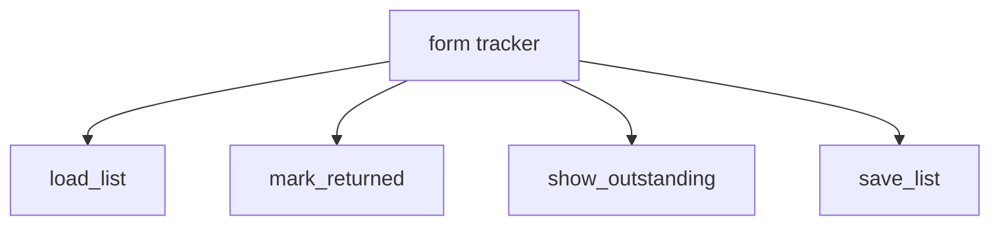

The first genuinely large request in this course arrives sounding like
one sentence. "Could you make me something that tracks who has returned
their permission forms?" It is not one sentence. It is at least six
programs, and the hour people lose is the hour spent typing before
anybody worked out which six.

Decomposition is the habit of cutting a problem into parts small enough
to be obviously right, and it happens on paper, before the keyboard.

## Cut until each piece fits in your head

Take the forms request apart by asking, repeatedly, "what has to happen
first?"

- [ ] Read the list of names and their form status from somewhere
- [ ] Let the teacher mark one student's form as returned
- [ ] Show who is still outstanding
- [ ] Save the list so tomorrow starts where today ended
- [ ] Cope with a name that is not on the list

Five pieces, each describable in one line, each testable on its own.
That is the finish condition for this stage: if you cannot say what a
piece does in a sentence without "and", it is still two pieces.

This is stepwise refinement — take a step, notice it is still too big,
break it again. Other strategies belong in the same toolbox: working
backwards from the output the person wants, trying an extreme case (an
empty list, a class of ninety), or building a table of examples until
the rule becomes obvious. Reach for a different one when the first
stops making progress, rather than pushing harder on a strategy that
has stalled.

## Write the design where somebody can argue with it

A design that lives only in your head cannot be checked by anyone,
including you. Three cheap ways to make it visible:

**Pseudocode** — the steps in plain sentences, indented like code but
written for a person:

```
ask which student
if the name is not in the list
    say so and stop
otherwise
    mark that student's form as returned
    save the list
    show who is still outstanding
```

**A flow chart** for anything with branches, exactly as in
[[Making Decisions]] — it is the fastest way to get a decision
confirmed by the person who asked for it.

**A structure chart** for how the pieces fit together, once they are
functions:



Each of those is a normal, professional way to describe a program
before writing it, and each one lets somebody else say "that is not
what I meant" while changing your mind is still cheap.

## One piece, one function

Decomposition and [[Functions]] are the same idea at two scales. Each
box in the chart above becomes a function with a name that says what it
does, and the main part of your program becomes short enough to read in
one screen:

```python
students = load_list()
mark_returned(students, name)
show_outstanding(students)
save_list(students)
```

You can read that to the teacher who asked, out loud, and she can tell
you whether it is right — before a single one of those functions
exists. When one of them turns out to be wrong, exactly one of them
changes. That is modularity's practical payoff: reusable pieces, and
damage that stays where it happened.

## Where designs go wrong

- **Pieces that overlap.** Two functions that both decide who is
  outstanding will disagree eventually. Decide once, in one place.
- **A piece that is secretly the whole problem.** "Handle the data" is
  not a piece. Keep cutting.
- **Designing for the program instead of the person.** The
  decomposition above starts from what the teacher does, not from what
  is convenient to code — and that ordering is worth defending when the
  two disagree.

Read a small program that was cut up this way in
[[Writing Functions]], bring a real request to [[The Client Interview]]
and cut it up before you build it, then use the same habit on the big
one. [[The Community App]] is the point where designing first stops
being advice and starts being the difference between finishing and not.

%%curriculum-start%%
## Curriculum connection

![[B1.1]]

![[B2.2]]

![[B2.3]]

![[B2.4]]
%%curriculum-end%%
