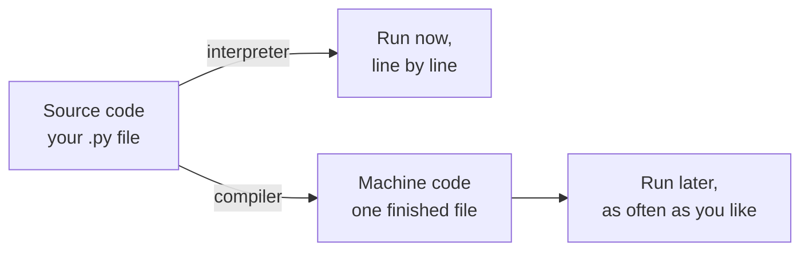

The file you typed is text. A processor cannot read text; it reads
numbered instructions, and only its own. Something has to stand between
the two, and which something you choose changes how your day feels.

## Two kinds of code

**Source code** is what you write: `total = total + value`, meant for a
person, and readable by anyone who knows the language. **Machine code**
is what the processor executes: numbered operations on registers and
memory addresses, specific to that family of processors, and unreadable
in practice.

Nobody writes machine code by hand any more, and nobody reads yours.
The distinction still matters, because it explains why a program built
for one kind of machine will not simply run on another.

## Two ways to cross the gap

An **interpreter** reads your source and carries it out as it goes.
Python works this way, which is why you can change a line and run
again immediately, and why an error in line 40 appears only when line
40 is reached — the first thirty-nine lines had already run.

A **compiler** translates the whole program first and hands you a
finished executable. C and Java work this way. Nothing runs until the
translation succeeds, so a mistake in line 40 is reported before line 1
has done anything, and the result runs faster because the translating
is over.

| | Interpreter (Python) | Compiler (C) |
| --- | --- | --- |
| When translation happens | While running | Before running |
| When you learn about an error | When that line is reached | Before anything runs |
| Speed of the running program | Slower | Faster |
| Speed of trying a change | Immediate | Wait for the build |
| What you hand somebody | Source, plus an interpreter | One executable file |

Neither is better. An interpreter suits learning and quick change; a
compiler suits programs that must be fast and shipped once. Python
itself is written in C — the tool you use daily was built with the
other approach.

> [!note]- Where the boundary blurs
> Python quietly compiles your source into an intermediate form
> (bytecode, those `__pycache__` folders) and interprets *that*. Java
> compiles to bytecode too, then runs it on a virtual machine. Real
> systems mix the two freely; the distinction that survives is *when*
> translation happens, not whether.

## Why this shows up in your errors

A `SyntaxError` is the interpreter refusing to proceed because it
cannot understand the text at all — the translation failed before the
work began. A `NameError` at line 40 is different: translation was fine
and the program genuinely ran, right up until it needed a name nobody
had defined. [[Reading an Error Message]] leans on that difference, and
so does the order in which you should fix things.

%%curriculum-start%%
## Curriculum connection

![[C3.3]]

![[C3.4]]
%%curriculum-end%%
