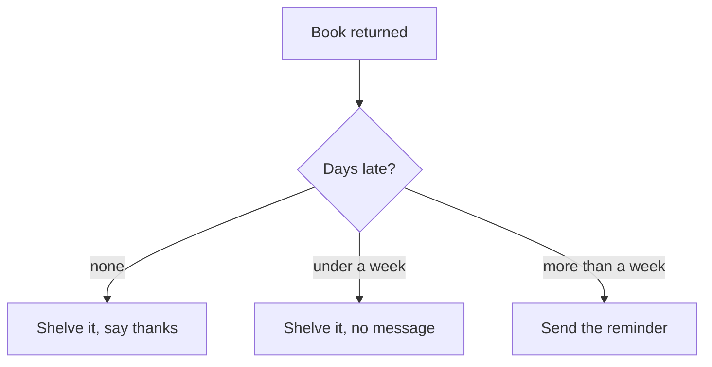

Everything you had written until now ran the same way every time. Then
somebody described the library return desk: a book comes back, and what
happens next depends on how late it is. Nobody could write that as a
straight list of steps. On the whiteboard it came out as a diagram with
branches — and a diagram with branches is a program with `if` in it.

## One question, three answers



Draw the diagram first, every time, until you stop needing to. It is
also how you check a decision with the person who asked for the
program: Mr. Whitfield can look at that picture and say "no — under a
week I still want to know", which is a thirty-second conversation
instead of a rewrite. A flow chart is one of the design tools the
course expects you to use, alongside the pseudocode and structure
charts in [[Decomposition and Design]].

## The shape in Python

```python
if days_late <= 0:
    print("On time. Shelve it and say thanks.")
elif days_late <= 7:
    print("Less than a week late. Shelve it, no message.")
else:
    print("Send the standard reminder.")
```

Four things are doing work here:

- The **condition** — `days_late <= 0` — is an expression that comes
  out `True` or `False`, built from the comparison operators: equal to
  `==`, not equal to `!=`, and `<`, `>`, `<=`, `>=`.
- The **colon** ends the question.
- The **indentation** says what belongs to that branch. Python is not
  being fussy; the indenting *is* the grouping, where other languages
  use braces.
- Exactly one branch runs. `elif` means "otherwise, if", and `else`
  catches everything left over.

`else` is optional, but leaving it out is a decision too: it means
"when none of these match, do nothing". Say that out loud and check it
is what you want.

## Order matters more than you expect

This looks reasonable and is wrong:

```python
mark = 91

if mark >= 50:
    print("Pass")
elif mark >= 80:
    print("Excellent")
```

It prints `Pass`. A 91 satisfies the first condition, so Python never
looks at the second — the `Excellent` branch is unreachable for every
mark that could ever reach it. In an `elif` chain, the most demanding
condition goes first:

```python
if mark >= 80:
    print("Excellent")
elif mark >= 50:
    print("Pass")
else:
    print("Not yet")
```

Nothing about the broken version is a syntax error, and Python will
never warn you. This is a **logic error**, and the only thing that
catches it is trying a value from each branch on purpose — the habit
built in [[Testing and Debugging]] and drilled in [[Trace It]].

## Nesting, and when to stop

An `if` inside an `if` is legal and sometimes exactly right:

```python
if days_late > 0:
    if days_late > 30:
        print("Ask in person.")
    else:
        print("Send the reminder.")
```

But three levels of nesting is usually a sign that the conditions want
to be combined instead — `and`, `or`, and `not` are next, in
[[Boolean Logic]]. Practise the branching itself in
[[Decisions Practice]], then read a complete decision-driven program in
[[Branching Programs]].

%%curriculum-start%%
## Curriculum connection

![[A1.4]]

![[A2.2]]

![[B2.4]]
%%curriculum-end%%
