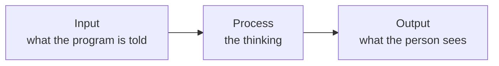

In [[The Unplugged Algorithm]] one person read the instructions out
loud and another had to follow them exactly — no guessing, no filling
in the obvious. The class watched somebody spread peanut butter with
the lid still on the jar, and laughed, and then went quiet, because
every instruction that failed had seemed perfectly clear when it was
written.

A program is a set of instructions precise enough that something with
no judgement at all can carry them out and still get the result you
meant. That is the whole subject. Everything else — types, loops,
functions, files — exists because "precise enough" is harder than it
sounds.

## Input, process, output

Almost every useful program has the same three-part shape, and naming
the three parts before you write anything is the fastest way to find
out what you are actually building.

Try it on a program somebody needs. A coach wants to know the team's
average practice time this week. *Input*: the minutes for each day.
*Process*: add them up, divide by seven. *Output*: one sentence she can
read on the bus. You have now specified a program without writing a
line of code — and you can already tell her what it will and will not
do.

## Source code, machine code

What you type is **source code**: text, readable by a person, written
in a language with rules. The processor in the machine does not read
it. It runs **machine code** — numbers that mean things like "copy this
value into that register". Something has to get you from one to the
other.

- A **compiler** translates the whole program ahead of time and hands
  you a file the machine can run directly. Nothing translates while it
  runs; the translation already happened.
- An **interpreter** reads your source and carries it out a piece at a
  time, every time you run it.

Python uses an interpreter, which is why you can change one line, hit
run, and see the result immediately, and why an error in line 40 can
still surprise you after lines 1 to 39 have already printed their
output.[^1]

## Languages, applications, operating systems

Three words that get muddled constantly, sorted out:

- A **programming language** is a notation for writing instructions —
  Python, and thousands of others.
- An **application** is a finished program somebody uses to get
  something done — a browser, a mark book, the thing you are about to
  build for a real person.
- An **operating system** is the program that runs the other programs:
  it hands out memory, owns the files, and decides who gets the
  processor next. When your program opens a file, it does not touch the
  disk. It asks the operating system to.

## Where this goes next

The rest of Unit 1 fills in the shape above:
[[Variables and Data Types]] for what a program remembers,
[[Input and Output]] for the two ends of the diagram, and
[[Making Decisions]] for the moment a program stops doing the same
thing every time. Get Python running with [[Setting Up Python]], then
read a real one in [[Your First Python Program]].

[^1]: Strictly, Python's interpreter does translate your code into a
    compact internal form first, and caches it. It never hands you a
    machine-code file the way a C compiler does, which is the
    difference that matters here.

%%curriculum-start%%
## Curriculum connection

![[B1.3]]

![[C3.3]]

![[C3.4]]

![[C3.5]]
%%curriculum-end%%
