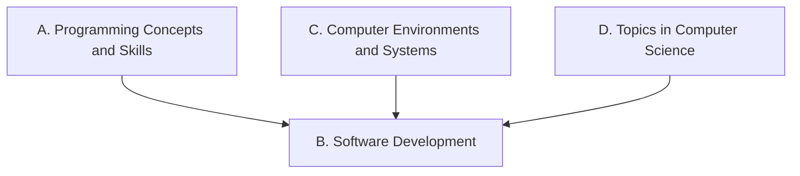

Everything we do in this course points at one or more of these
expectations, from **ICS3U — Introduction to Computer Science,
Grade 11, University Preparation**. Lesson pages link here so
you can always see *why* we are doing something.

> [!info] Where these come from
> The wording below is the Ontario curriculum's own. See
> [[About These Expectations]] — including a note about the codes.

## Overall and specific expectations

### Strand A. Programming Concepts and Skills
*By the end of this course, students will:*

![[A1. Data Types and Expressions]]
![[A1.1]]
![[A1.2]]
![[A1.3]]
![[A1.4]]
![[A1.5]]
![[A1.6]]
![[A2. Control Structures and Simple Algorithms]]
![[A2.1]]
![[A2.2]]
![[A2.3]]
![[A3. Subprograms]]
![[A3.1]]
![[A3.2]]
![[A4. Code Maintenance]]
![[A4.1]]
![[A4.2]]
![[A4.3]]
![[A4.4]]
![[A4.5]]

### Strand B. Software Development
*By the end of this course, students will:*

![[B1. Problem-solving Strategies]]
![[B1.1]]
![[B1.2]]
![[B1.3]]
![[B2. Designing Software Solutions]]
![[B2.1]]
![[B2.2]]
![[B2.3]]
![[B2.4]]
![[B2.5]]
![[B3. Designing Algorithms]]
![[B3.1]]
![[B3.2]]
![[B3.3]]
![[B4. The Software Development Life Cycle]]
![[B4.1]]
![[B4.2]]
![[B4.3]]
![[B4.4]]
![[B4.5]]
![[B4.6]]

### Strand C. Computer Environments and Systems
*By the end of this course, students will:*

![[C1. Computer Components]]
![[C1.1]]
![[C1.2]]
![[C1.3]]
![[C1.4]]
![[C2. File Maintenance]]
![[C2.1]]
![[C2.2]]
![[C2.3]]
![[C3. Software Development]]
![[C3.1]]
![[C3.2]]
![[C3.3]]
![[C3.4]]
![[C3.5]]

### Strand D. Topics in Computer Science
*By the end of this course, students will:*

![[D1. Environmental Stewardship and Sustainability]]
![[D1.1]]
![[D1.2]]
![[D1.3]]
![[D1.4]]
![[D2. Exploring Computer Science]]
![[D2.1]]
![[D2.2]]
![[D2.3]]
![[D3. Postsecondary Opportunities]]
![[D3.1]]
![[D3.2]]
![[D3.3]]
![[D3.4]]
![[D3.5]]
