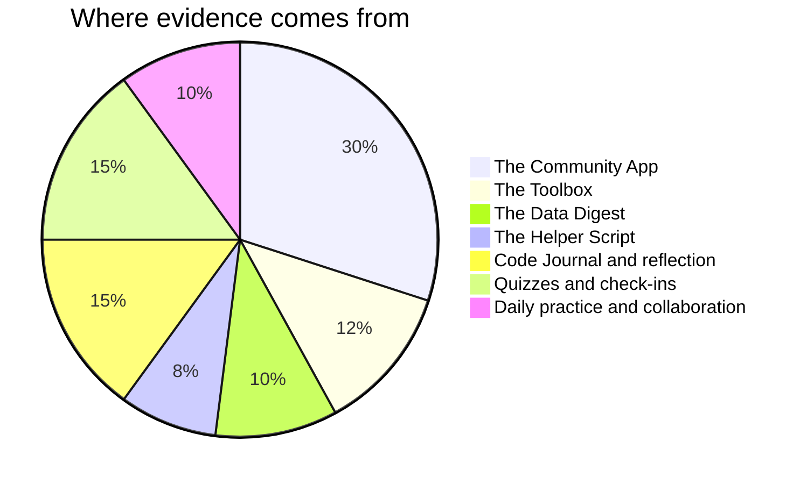

Marks in this course worry people for one wrong reason: the belief
that some people are "programmers" and the rest are here to watch. No
such split exists. Reading code, writing code, and building something
a person can use are learned skills, and you are marked on process,
growth, and what your work does for somebody else — all of it inside
your control.

## Where the evidence comes from

[[The Community App]] is deliberately the largest single piece of the
course. It runs across the last two units, it is built for a real
person, and it is where everything else you have learned finally has
to work at the same time. The three earlier tasks —
[[The Helper Script]], [[The Data Digest]], and [[The Toolbox]] — are
the rehearsals that make it possible.

**Quizzes** are short, frequent, low-stakes, and re-attemptable after
new learning. They exist to find out what needs work, not to close the
book on it.

**Reflection** is your [[Code Journal]], where a broken build turns
into evidence of learning — often the strongest evidence you have.

**Daily practice** is the small stuff done consistently: warm-up
predictions committed to in ink, driving and navigating fairly in
pairs, the question that unlocked a neighbour's bug.

> [!important] Small and used beats ambitious and broken
> On every task, and most of all on the culminating project, a modest
> program that works and that somebody actually uses scores higher
> than a grand design that does not run. This is not a consolation
> prize for low ambition — judging scope accurately is one of the
> hardest skills in software, and [[Interviewing Your Client]] treats
> it as a professional skill because it is one.

> [!important] Broken programs are never penalised as broken
> Version one of everything crashes. The mark follows where your work
> ends up and how visibly you got there — your journal and your
> comments are how "visibly" happens.

Each task page lists its success criteria before you start, phrased as
things an observer could see in your work. If a mark ever surprises
you, ask: those criteria are the whole story, and [[Getting Help]]
lists the ways to reach me.
