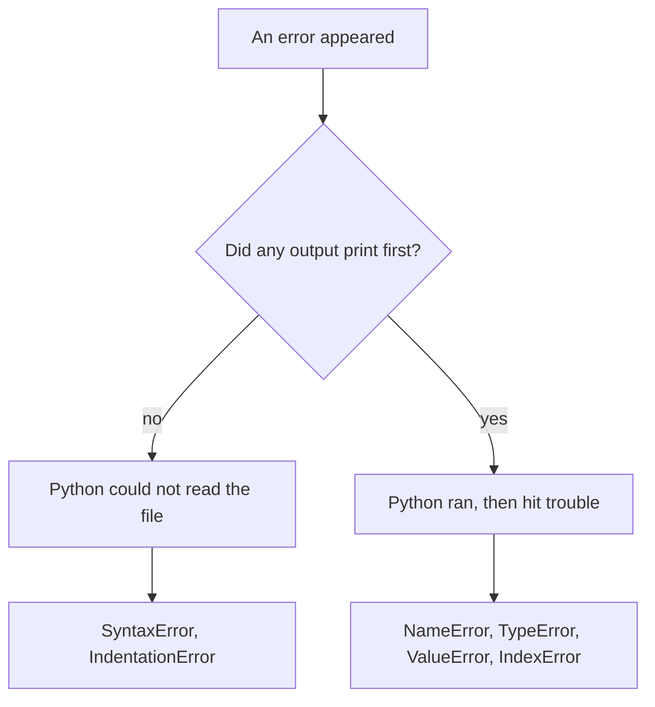

A traceback goes on the board with no program attached. Two questions:
what does Python mean by this, and what kind of line must have caused
it? Error messages are the most honest writing you will read all day,
and they use a small, learnable vocabulary. Thirty rounds of this and
the panic reflex is simply gone.

## First, which side of the line is it on?



That first split does half the diagnosis. A program that produced
output before dying was understood by Python; something about the
*values* it met was wrong.

## Today's board

```
Traceback (most recent call last):
  File "/home/student/hours.py", line 2, in <module>
    count = int(answer)
ValueError: invalid literal for int() with base 10: 'abc'
```

Read the bottom line first: `int()` was handed the text `'abc'` and
could not turn it into a whole number. Line 2 is where it happened.
The cause is almost always one line earlier — an `input()` whose
result nobody checked.

## The vocabulary

| Message | Python is telling you |
| --- | --- |
| `NameError: name 'average' is not defined` | You used a name before creating it, or spelled it differently |
| `TypeError: can only concatenate str (not "int") to str` | You joined text and a number with `+` |
| `ValueError: invalid literal for int() with base 10: 'abc'` | The conversion was fine; the value was not |
| `IndexError: list index out of range` | You asked for a position the list does not have |
| `IndentationError: expected an indented block after 'if' statement on line 2` | A line ending in `:` was not followed by indented lines |

## How to run it

1. One traceback on the board, no context.
2. Everyone writes the diagnosis in one sentence, then a guess at the
   line that caused it.
3. Compare. Then reveal the program and check.

The full anatomy of a traceback is in [[Reading an Error Message]];
this warm-up is the drill that makes it automatic.
