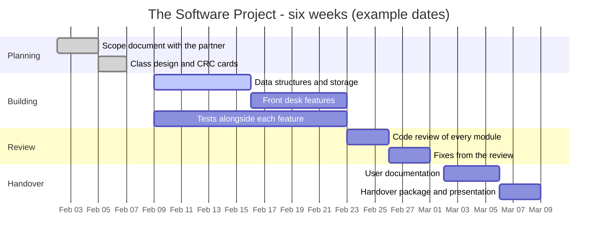

Every team in this course starts [[The Software Project]] the same
way: four people, one community partner, six weeks, and an
overwhelming urge to open an editor and start typing. Teams that do
that produce three incompatible halves of the same feature by Friday
and a demonstration nobody can run.

Managing a project is not paperwork bolted onto programming. It is the
part that decides whether four people's work adds up to one program —
and it is assessed, because in industry it is the difference between a
team and four individuals in a room.

## Scope first: what it is, and what it is not

Before any code, write a **scope document** with the partner in the
room. One page is plenty, and it says:

- **The problem, in the partner's words.** Not your solution — their
  Tuesday afternoon.
- **What the software will do.** Three to five statements, each one
  something the partner could check.
- **What it will not do.** The most valuable section on the page.
  "Version one does not send email" prevents a fortnight of argument.
- **Who it is for, and what it stores about them.** If the answer
  includes personal information, say why each field is needed — see
  [[Ethics, Security, and the Profession]].
- **What "finished" means**, in a sentence you would be willing to be
  judged by.

Scope creep is not a partner asking for more. It is a team saying yes
without changing the schedule. When something new arrives — and it
will — the professional answer is "yes, and here is what moves".

## Tasks, owners, dates

Break the scope into tasks small enough that one person can finish one
in a class or two. Every task gets **one owner** and a date. "The
team" is not an owner; work owned by everybody is done by nobody.

A Gantt chart earns its place by showing two things a task list
cannot: what runs **in parallel**, and what is **blocked** by
something else. Notice that testing runs alongside building rather
than after it, and that the review has fixes budgeted after it —
booking a review with no time to act on it is theatre.

A calendar or a shared board works just as well for a project this
size; [[B1.4|the project-tool expectation]] accepts any of them. What
it does not accept is a plan that lives only in one person's head.

## Roles, meetings, and the milestone that saves you

| Role | Owns | Does not own |
| --- | --- | --- |
| Coordinator | Schedule, partner contact, the plan | Everybody's code |
| Data owner | Classes, storage, file format | Interface decisions alone |
| Interface owner | What the user sees and types | Silent changes to the data |
| Quality owner | Test suite, review checklist | Blame |

Rotate them if you like, but write them down. Then hold a five-minute
stand-up at the start of every build period: what I finished, what I
am doing next, what is blocking me. Five minutes, standing, no
laptops. It surfaces the "I have been stuck since Tuesday" that
otherwise surfaces in week five.

Set an **integration milestone** at the halfway point, where all the
parts must run together even if they are ugly. Teams that skip it
discover in the last period that two modules have never met, and
[[Version Control]] cannot rescue a design that never agreed on an
interface.

> [!important] Deadlines are promises to people, not to a teacher
> [[B2.2|The individual time-management expectation]] is about the
> fact that your teammates cannot start until you finish. Being three
> days late on your module is not three days of your own time; it is
> three days multiplied by everybody waiting. If you are going to be
> late, the professional move is to say so early enough that the plan
> can change.

## Closing, and reviewing the management

A project is not finished when the code runs. Closing means: the
partner confirms it does what the scope said, they receive it in a
form they can actually use, the user documentation exists, and
somebody has agreed who maintains it. That is [[The Handover]], and it
is the mark.

Then, separately, review the *management* — plan against reality. What
took twice as long as estimated? Which task should have been three
tasks? What would you do differently with the same six weeks? Written
honestly, that report is the most useful page in the whole project,
and it is what [[B1.6|the project review expectation]] asks for. Do it
with your team, then put the personal version in your
[[Final Reflection]].

The team-working habits underneath all of this are in
[[Working in a Team]]; the review conversation itself is
[[The Code Review]].

%%curriculum-start%%
## Curriculum connection

![[B1.1]]

![[B1.4]]

![[B1.6]]
%%curriculum-end%%
