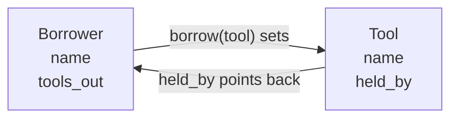

The community centre lends tools on Saturday mornings — a drill, a
step ladder, a mower — and the sign-out sheet has one failure mode
everybody knows about. Somebody writes their name beside the drill,
somebody else writes theirs beside the drill on the next line, and at
noon two people are standing at the desk holding the same piece of
paper.

The problem is not the sheet. It is that the sheet stores the fact
"Priya has the drill" in one place, where nothing checks it. When two
objects each know their side of a relationship, the check happens
automatically — and it happens in the class that owns the fact.

## The program

This one is two files, because the classes and the program that uses
them are two different jobs. Save both in the same folder and run
`desk.py`.

```python
"""Classes for the tool library the community centre runs on Saturdays.

Two classes live here. A Tool knows its own name and whether it is on
the shelf. A Borrower knows their name and what they currently have
out. Neither class prints anything: printing is the front desk's job,
in desk.py.
"""


class Tool:
    """One item on the tool library's shelf."""

    def __init__(self, name):
        self.name = name
        self.held_by = None

    def is_available(self):
        """True when nobody has this tool signed out."""
        return self.held_by is None

    def __str__(self):
        if self.is_available():
            return f"{self.name} (on the shelf)"
        return f"{self.name} (out with {self.held_by.name})"


class Borrower:
    """One member of the tool library, and the tools they hold."""

    def __init__(self, name):
        self.name = name
        self.tools_out = []

    def borrow(self, tool):
        """Sign a tool out to this borrower. Return True if it worked."""
        if not tool.is_available():
            return False
        tool.held_by = self
        self.tools_out.append(tool)
        return True

    def give_back(self, tool):
        """Return a tool to the shelf. Return True if it worked."""
        if tool not in self.tools_out:
            return False
        tool.held_by = None
        self.tools_out.remove(tool)
        return True

    def __str__(self):
        if len(self.tools_out) == 0:
            return f"{self.name} has nothing out"
        names = []
        for tool in self.tools_out:
            names.append(tool.name)
        return f"{self.name} has out: {', '.join(names)}"
```

That file is `toollibrary.py`. This one is `desk.py`:

```python
"""The front desk of the Saturday tool library. Run this file."""

from toollibrary import Tool, Borrower

drill = Tool("cordless drill")
ladder = Tool("step ladder")
mower = Tool("push mower")
shelf = [drill, ladder, mower]

priya = Borrower("Priya")
sam = Borrower("Sam")


def show_shelf(shelf):
    """Print every tool and where it is."""
    for tool in shelf:
        print(f"  {tool}")


print("Saturday, 9:00 a.m.")
show_shelf(shelf)

print()
print("Priya asks for the drill and the ladder.")
print(f"  drill signed out: {priya.borrow(drill)}")
print(f"  ladder signed out: {priya.borrow(ladder)}")
print(f"  {priya}")

print()
print("Sam asks for the drill.")
print(f"  drill signed out: {sam.borrow(drill)}")
print(f"  {sam}")
print(f"  the drill is {drill}")

print()
print("Priya brings the drill back. Sam tries again.")
print(f"  drill returned: {priya.give_back(drill)}")
print(f"  drill signed out: {sam.borrow(drill)}")
show_shelf(shelf)

print()
print("Sam tries to return the ladder he never had.")
print(f"  ladder returned: {sam.give_back(ladder)}")
print(f"  {priya}")
print(f"  {sam}")
```

```text
Saturday, 9:00 a.m.
  cordless drill (on the shelf)
  step ladder (on the shelf)
  push mower (on the shelf)

Priya asks for the drill and the ladder.
  drill signed out: True
  ladder signed out: True
  Priya has out: cordless drill, step ladder

Sam asks for the drill.
  drill signed out: False
  Sam has nothing out
  the drill is cordless drill (out with Priya)

Priya brings the drill back. Sam tries again.
  drill returned: True
  drill signed out: True
  cordless drill (out with Sam)
  step ladder (out with Priya)
  push mower (on the shelf)

Sam tries to return the ladder he never had.
  ladder returned: False
  Priya has out: step ladder
  Sam has out: cordless drill
```

## How it works

Two classes, one relationship, stored from both ends:



`Tool.held_by` is either `None` or **a `Borrower` object** — not a
name, not a string. That is why `__str__` can write
`out with {self.held_by.name}`: the tool is holding the person, so it
can ask them their name. Store the string instead and you have the
clipboard again, with two spellings of "Priya" and no way to reach the
rest of her record.

The double booking is impossible because `borrow` asks first:

```python
if not tool.is_available():
    return False
```

Sam's request fails, and it fails *quietly and reportably* — `False`
comes back, the front desk prints it, and nothing is corrupted. A
method that returns a success flag lets the caller decide what to say
to the person standing there.

`give_back` is guarded from the other side. Sam never had the ladder,
so `tool not in self.tools_out` is true and the method refuses. Notice
what that protects: without the check, Sam returning Priya's ladder
would set `ladder.held_by = None` and leave the ladder in
`priya.tools_out` — the two halves of the relationship would disagree,
and the program would confidently print nonsense forever after.

**Why two files.** `toollibrary.py` is about tools and borrowers.
`desk.py` is about one Saturday morning. Keeping them apart means the
classes can be reused by an evening program, a report, or your
teammate's half of the project without dragging this morning's script
along. `from toollibrary import Tool, Borrower` is Python asking for
exactly the two names it needs. The file is imported by its *name*
without `.py`, and it must sit beside the file that imports it.

> [!important] Neither class prints
> Every `print` in this program lives in `desk.py`. The classes
> compute and return; the program decides what to say and when. Mix
> them and the classes become unusable anywhere the output is
> different — a web page, a report, a test. This is the same argument
> as "returns beat prints", one floor up.

## Change it

1. **One line.** Add `saw = Tool("hand saw")` and put it in `shelf`.
   Every listing that follows includes it with no other edit — the
   printing code was written against the list, not against three
   particular tools.
2. **A few lines.** Give `Tool` a `self.times_borrowed = 0` and add
   one to it inside `borrow`, just after the availability check. At
   the end of the morning, `drill.times_borrowed` is `2` — the mower's
   is `0`, which is the number that tells the centre what to stop
   buying.
3. **A real change.** Add a waiting list. Give `Tool` a
   `self.waiting = []`; when `borrow` fails, append the would-be
   borrower to it; and at the end of `give_back`, if anybody is
   waiting, take the first person off the front and sign the tool out
   to them. Sam now gets the drill the moment Priya returns it, with
   nobody at the desk — and watch what that does to the line below it:
   `sam.borrow(drill)` now prints `False`, because Sam already has the
   tool he is asking for. A correct change that makes existing output
   go false is exactly the kind of thing [[Testing and Regression]]
   exists to catch. First in, first out is a **queue**, and
   [[A Stack and a Queue]] gives it a proper name and a proper class.

The ideas are in [[Objects Working Together]] and [[Encapsulation]];
the drill is in [[Methods and Encapsulation Practice]]. When you split
a program into files for your own project, hold yourself to
[[Writing Code Others Can Read]].

%%curriculum-start%%
## Curriculum connection

![[A2.1]]

![[C1.1]]

![[C1.4]]
%%curriculum-end%%
