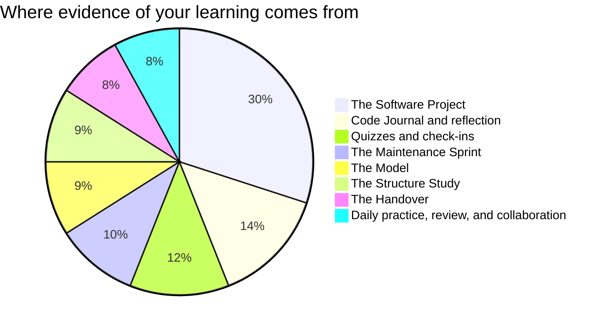

You are marked on what you can be seen to do: code you wrote,
decisions you defended, reviews you gave, problems you found in work
that was not yours. All of it is inside your control, and all of it
leaves a record.

## Where the evidence comes from

[[The Software Project]] is deliberately the largest single piece of
this course. It launches in Unit 3, runs to the end, is built by a
team for a real community partner, and is where everything else you
have learned finally has to work at the same time — objects,
structures, algorithms, tests, and four people who have to agree.
[[The Model]] and [[The Structure Study]] are the rehearsals that
make it possible, and [[The Maintenance Sprint]] is the one that
teaches the hardest skill in the course: changing code you did not
write, safely. [[The Handover]] closes it.

**Quizzes** are short, frequent, low-stakes, and re-attemptable after
new learning. They exist to find out what needs work, not to close
the book on it.

**Reflection** is your [[Code Journal]], and it carries more weight
this year than last, for a specific reason set out below.

**Daily practice** is the small stuff done consistently: warm-up
predictions committed to in ink, a review given properly, the
question that unlocked a teammate's bug.

## The group work question

Every student asks it and it deserves a straight answer: *what stops
me being dragged down by a team, or carried by one?*

**You do not receive a group mark for the team project.** There is a
shared component — the project has to work, and it has to be handed
over in a state your partner can use — and there is an individual
component, which is larger. Your individual mark comes from evidence
that is specific to you.

| Evidence | What it shows | Where it comes from |
| --- | --- | --- |
| Your commits | What you wrote, when, and in what size pieces | The repository history, under your own name |
| Your reviews | What you read, what you caught, how you said it | Comments on your teammates' changes |
| Your journal | What you decided, what you rejected, what changed your mind | [[Code Journal]], collected each unit |
| Your milestone check-ins | Whether you knew where the project stood | Short conversations with me during build periods |
| The handover documents you wrote | Whether somebody else can use what you built | [[The Handover]] |

Three things follow from that table, and they are worth taking
seriously in week one rather than week eight.

> [!important] Commit under your own name, in small pieces, often
> A commit is the most objective record you have. Forty small commits
> across the term say more about your contribution than one enormous
> one at the end, and a teammate committing your work for you erases
> you from the record. [[Using Version Control]] shows how; this is
> why it matters.

> [!important] Reviewing counts as contribution
> Finding the bug in somebody else's change is real work and it is
> assessed as real work. A student who writes less code but catches
> what would have shipped broken has contributed, and the review
> record proves it. This is deliberate — it is also true of
> professional teams, where it is routinely forgotten.

If your team is genuinely not working — somebody has stopped
contributing, or one person is carrying everything — that is a
problem to raise with me early, not to absorb quietly and mention in
June. [[Working in a Team]] has the protocols; [[Getting Help]] has
the ways to reach me. Nothing about that conversation counts against
you.

## Two things that are never penalised

> [!note] Small and used beats ambitious and broken
> On every task, and most of all on the team project, a modest
> program that works and that the partner actually uses scores higher
> than a grand design that does not run. Judging scope accurately is
> one of the hardest skills in software, and
> [[Software Project Management]] treats it as a professional skill
> because it is one.

> [!note] Broken programs are never penalised as broken
> Version one of everything crashes. The mark follows where your work
> ends up and how visibly you got there. Your commits, your journal,
> and your comments are how "visibly" happens.

Each task page lists its success criteria before you start, phrased
as things an observer could see in your work. If a mark ever
surprises you, ask — those criteria are the whole story.
