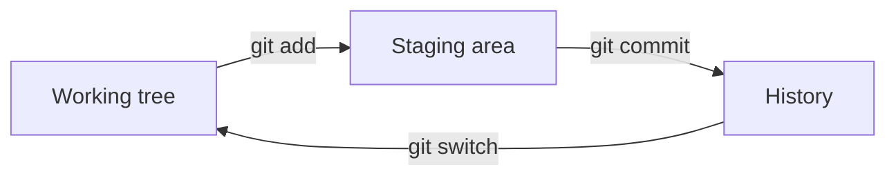
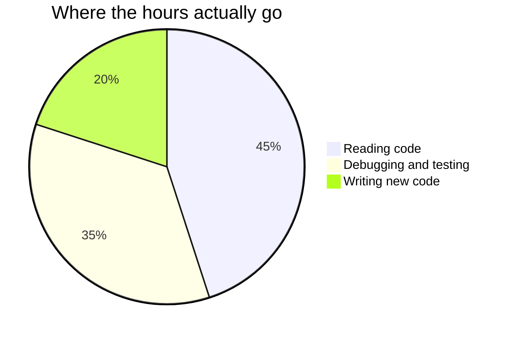

This page exists for two audiences. Students: it explains why the
notes look the way they do, and it is the reference for the writing
you will produce yourself this year. Teachers: it is a working
reference for everything a page can contain, with the source shown
for every example.

Everything below is written in **Markdown** — plain text with a few
marks of punctuation that mean something. It is also what README
files are written in, which is the practical reason to learn it
properly now.

---

## Text that carries meaning

You get **bold**, *italic*, ~~struck through~~, and ==highlighted==
text. Highlighting draws the eye better than bold when a single
==key term== needs to stand out in a paragraph.

**How that was made:**

```markdown
**bold**, *italic*, ~~struck through~~, ==highlighted==
```

Arrows written as `->` become real arrows: edit -> stage -> commit.

Keyboard keys look like keys: press <kbd>⌘</kbd> + <kbd>K</kbd> to
search.

---

## Code, coloured and exact

This is the feature a programming course lives on — runnable examples
with spacing and quotation marks preserved, coloured by meaning:

```python
class Session:
    """One bookable session: a day, a capacity, and who has booked."""

    def __init__(self, day, capacity):
        self.day = day
        self.capacity = capacity
        self.booked = []
```

Blocks marked `text` are for things that are not Python — terminal
sessions, tracebacks, and the diffs all over [[Read the Diff]]:

```text
$ git status
On branch main
nothing to commit, working tree clean
```

**How that was made:** three backticks and the language name, the
code, then three backticks to close. Every page in
[[Programs/index|Programs]] is built on this.

---

## Headings, and the table of contents

Every `##` heading becomes an entry in **Navigate this page** on the
right, generated from the headings themselves, so it can never fall
out of step with the page. Short pages read better without it; one
line of frontmatter (`enableToc: false`) turns it off, which every
class page does — an agenda of six items does not need navigating.

---

## Callouts

Callouts lift something out of the flow of the page, each kind with
its own colour and icon:

> [!note] Note
> Neutral information worth setting apart.

> [!tip] Tip
> A shortcut, a habit, or something that makes the work easier.

> [!important] Important
> The one thing to take away if you take away nothing else.

> [!warning] Warning
> Where people usually go wrong — off-by-one traps live in these.

> [!question] Question
> Something to think about rather than something to know.

> [!abstract] At a glance
> Used at the top of task pages for format and timing.

**How that was made:** a blockquote with the kind named in brackets.

```markdown
> [!warning] Where people usually go wrong
> The text of the callout goes here.
```

Keep the title on one line. Anything on the following lines is the
body, not the title.

### Foldable callouts

Add a `-` after the kind and the callout starts collapsed. Every
practice set hides its worked answers this way — try first, and the
answer is always there when you want it:

> [!success]- Worked answer
> There is only one list. `roster`, `seniors.members`, and
> `juniors.members` are three names for the same object, so appending
> through any of them changes what all three see.

```markdown
> [!success]- Worked answer
> The hidden solution.
```

---

## Diagrams

Diagrams here are **written, not drawn** — edited in seconds, never
needing a graphics program.



**How that was made:**

````markdown

````

Proportions draw themselves too:



---

## Tables

**How that was made:** rows of text separated by `|`, with a line of
dashes under the headings.

| Command | What it does | Read more |
| --- | --- | --- |
| `git status` | What has changed, and what to do next | [[Using Version Control\|the tutorial]] |
| `git diff` | The exact lines you changed | [[Read the Diff\|the warm-up]] |
| `git log --oneline` | The project's history, one line per commit | [[Version Control\|the concept]] |

> [!warning] Links inside table cells
> A link with different words for it normally separates the two with
> a `|`, which a table would read as the start of a new column. In a
> table cell, put a backslash in front of that bar and the table
> survives — as the right-hand column above does.

---

## Mathematics, if a page ever needs it

Most of this course needs none, but efficiency notation is easier to
read when it is typeset. Inline, like $O(n \log n)$, or given a line
of its own:

$$T(n) = 2\,T(n/2) + n$$

**How that was made:** single dollar signs keep it inside the
sentence; double ones give it a line to itself.

---

## Checklists

**How that was made:** a list where each line starts with `- [ ]`, or
`- [x]` for something already done.

- [ ] Predicted the output before running it
- [x] Names say what they hold
- [ ] Every new test failed at least once before it passed
- [ ] Somebody who is not on my team could run this from my README

On the site they are read-only — the boxes show what the page says, and
clicking one does nothing. Copied into your own notes, they are how
[[Journal Checklist]] turns from advice into habit.

---

## Links between pages

This is what makes the site more than a pile of documents.

- A plain link: [[Recursion]]
- A link with different words: [[Recursion|a function that calls itself]]
- A link to a section: add `#` and the heading's exact wording to the
  end of the link, which lands the reader on the paragraph rather
  than the page

**How that was made:** double square brackets around the page name.

### Transclusion — one page inside another

**How that was made:** `![[Page name]]` — a link with an exclamation
mark in front of it. The page's content appears here, live:

![[Help Sessions]]

Change the source page and every page that embeds it updates. That is
how the class landing page always shows current information without
anybody maintaining three copies of it — the documentation version of
the argument [[Writing Code Others Can Read]] makes about constants.

### Backlinks

At the bottom of any page is **Backlinks** — every page that links
*to* this one, gathered automatically. Open [[Version Control]] and
the backlinks name every tutorial, discussion, and task that leans on
it. Nobody maintains that list.

---

## Hover previews

Hover over [[Getting Unstuck]] without clicking and the page appears
in a small window. Checking one definition mid-problem does not cost
you your place.

---

## Footnotes

**How that was made:** `[^bug]` where the marker goes, and a matching
`[^bug]:` line anywhere in the page. The label can be any word, and
the note appears at the bottom no matter where you write it.

The word "bug" is older than the computer.[^bug]

---

## Tags

**How that was made:** a `tags` list in the frontmatter at the top of
the page.

```yaml
---
tags:
  - concepts
  - unit-4
---
```

Every tag becomes a page listing everything filed under it.

---

## What you cannot see

Two things on this page are invisible in the browser:

1. **Comments.** Text wrapped in `%%` double percent marks `%%` never
   reaches the site — useful for notes to yourself in a page you are
   still writing.
2. **Holding a page back.** A page with `publish: false` in its
   frontmatter is skipped entirely when the site is built. Write next
   week's lesson today and publish it when you are ready.

%% This sentence is a comment. If you can read it on the website, something is broken. %%

> [!tip] For teachers reading this
> With more than one section, per-section keys such as
> `publishForSection1` and `publishForSection2` let a single shared page
> be published to one class and held back from another — useful when two
> sections sit a few days apart.

---

## The point of all this

None of it is decoration. Each feature removes a reason for a page to
go out of date:

| Feature | The problem it solves |
| --- | --- |
| Coloured code | Screenshots of code nobody can copy or run |
| Transclusion | The same text copied into six places, five of them stale |
| Backlinks | "What else depends on this?" |
| Folded answers | Solutions that spoil the attempt |
| Holding a page back | Next week's lesson hiding in a file somewhere |

Write it once, link to it everywhere. That sentence is also the whole
of [[Writing Code Others Can Read]], said about prose instead of
functions.

[^bug]: Engineers were calling mechanical faults "bugs" in the 1800s.
    The famous computing example came in 1947, when Grace Hopper's
    team taped an actual moth into their logbook after it jammed a
    relay: "first actual case of bug being found".
