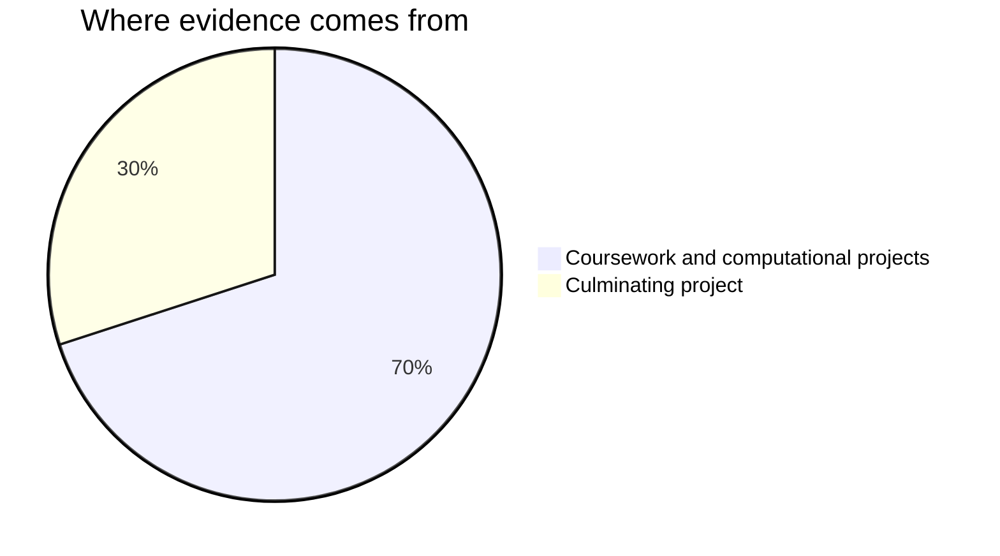

Marks in this course worry people for one wrong reason: the belief that some people are 
"programmers" and the rest are here to watch. No such split exists. Reading code, writing 
code, and building something a person can use are learned skills. You are marked on process, 
growth, and what your work does — all of it inside your control.

## Where the evidence comes from

**The coursework (70%)** consists of the three progressive projects you develop
across Units 1 through 3 — [[Task 1 - Pacific Trail Route Planner]],
[[Task 2 - Salish Sea Marine Sensor Tracker]], and
[[Task 3 - Indigenous Language Lexicon Engine]] — together with the reflective
entries in your [[Learning Journey Log]]. Each project builds practical
computational competence and ethical awareness across BC contexts before you
tackle the capstone.

**The culminating project (30%)** is [[Task 4 - Wildfire Early Warning Dashboard]],
a multi-module emergency management system and technical showcase developed across
the final unit that brings together algorithmic modeling, automated testing, and
critical infrastructure ethics.

**Check-ins and code tracing** are short, diagnostic, and low-stakes. They exist
to find out what needs work before project deadlines, not to close the book on it.

**Reflection** is your [[Learning Journey Log]], where a broken build turns into
evidence of learning — often the strongest evidence you have. Strong programmers
document their pivots and explain why their final design works.

> [!important] Small and used beats ambitious and broken
> On every task, and most of all on the culminating project, a modest program that works 
> scores higher than a grand design that does not run. This is not a consolation prize for 
> low ambition — judging scope accurately is one of the hardest skills in software.

> [!important] Broken programs are never penalised as broken
> Version one of everything crashes. The mark follows where your work ends up and how 
> visibly you got there — your journal and your comments are how "visibly" happens.

Each task page lists its success criteria before you start. If a mark ever surprises you, 
ask: those criteria are the whole story.
