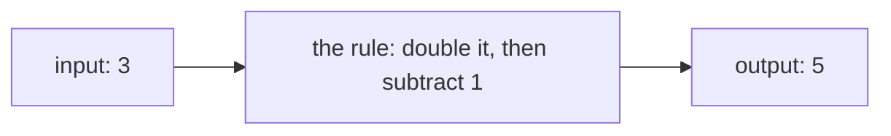

In [[The Function Machine]], your group fed numbers into hidden rules
and logged what came out. Most machines were dependable: give one a 3
today and a 3 tomorrow, and it answers the same both times. One
machine was not — asked for the numbers that square to make 9, it
shrugged and offered two. The dependable ones have a name. A
*function* is a relation that produces exactly one output for each
input.

## One idea, five costumes

A relation can be dressed as a table of values, a mapping diagram, a
graph, a function machine, or an equation — and each costume has its
own tell when the relation is *not* a function:

- In a **table**, the same input appears twice with different outputs.
- In a **mapping diagram**, an arrow splits — one input pointing at
  two outputs. (Two inputs pointing at *one* output is fine:
  many-to-one is legal; one-to-many is not.)
- On a **graph**, some vertical line crosses the curve twice. That is
  the vertical-line test: a vertical line marks one input, and a
  function may only answer it once.
- In an **equation**, solving for $y$ produces two values from one
  $x$.

Try it on $x = y^2$. Feed in $x = 4$: both $y = 2$ and $y = -2$
satisfy the equation, so this relation gives two outputs for one
input — not a function. Its mirror twin $y = x^2$ *is* one: inputs
$2$ and $-2$ happen to share the output $4$, but sharing an output
breaks no rules.

## The guarantee, and what it buys

That one-output guarantee is what makes the rest of this course
possible. Because a function answers each input exactly once, we can
give the machine a name and write $f(3)$ knowing it names a *single*
number — the whole language of [[Function Notation]] rests on it. And
the course ahead is a tour of function families: quadratic,
exponential, sinusoidal, discrete. Each one keeps the same promise in
a different accent.

A good warm-up for your eye: in [[Which One Doesn't Belong]], one
frame is often the relation that quietly fails the test. The first
questions of [[Function Notation Practice]] let you make the call
yourself and defend it.

%%curriculum-start%%
## Curriculum connection

![[A1.1]]

![[A1.2]]
%%curriculum-end%%
