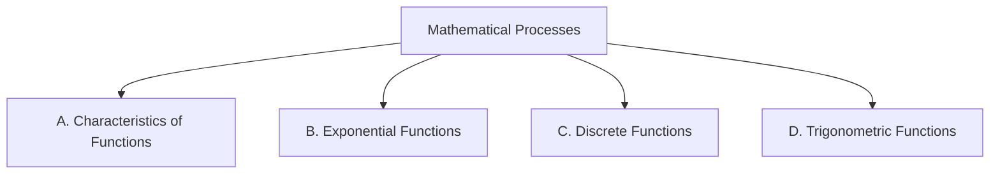

Everything we do in this course points at one or more of these
expectations, from **MCR3U — Functions, Grade 11, University
Preparation**. Lesson pages link here so you can always see *why*
we are doing something.

> [!info] Where these come from
> The wording below is the Ontario curriculum's own. See
> [[About These Expectations]] — including a note about the codes.

Seven mathematical processes run through every strand; the strands
name the mathematics itself.

## The mathematical processes

![[Mathematical Process Expectations]]

## Overall and specific expectations

### Strand A. Characteristics of Functions
*By the end of this course, students will:*

![[A1. Representing Functions]]
![[A1.1]]
![[A1.2]]
![[A1.3]]
![[A1.4]]
![[A1.5]]
![[A1.6]]
![[A1.7]]
![[A1.8]]
![[A1.9]]
![[A2. Solving Problems Involving Quadratic Functions]]
![[A2.1]]
![[A2.2]]
![[A2.3]]
![[A2.4]]
![[A2.5]]
![[A3. Determining Equivalent Algebraic Expressions]]
![[A3.1]]
![[A3.2]]
![[A3.3]]
![[A3.4]]

### Strand B. Exponential Functions
*By the end of this course, students will:*

![[B1. Representing Exponential Functions]]
![[B1.1]]
![[B1.2]]
![[B1.3]]
![[B1.4]]
![[B2. Connecting Graphs and Equations of Exponential Functions]]
![[B2.1]]
![[B2.2]]
![[B2.3]]
![[B2.4]]
![[B2.5]]
![[B3. Solving Problems Involving Exponential Functions]]
![[B3.1]]
![[B3.2]]
![[B3.3]]

### Strand C. Discrete Functions
*By the end of this course, students will:*

![[C1. Representing Sequences]]
![[C1.1]]
![[C1.2]]
![[C1.3]]
![[C1.4]]
![[C1.5]]
![[C1.6]]
![[C2. Investigating Arithmetic and Geometric Sequences and Series]]
![[C2.1]]
![[C2.2]]
![[C2.3]]
![[C2.4]]
![[C3. Solving Problems Involving Financial Applications]]
![[C3.1]]
![[C3.2]]
![[C3.3]]
![[C3.4]]
![[C3.5]]
![[C3.6]]
![[C3.7]]

### Strand D. Trigonometric Functions
*By the end of this course, students will:*

![[D1. Determining and Applying Trigonometric Ratios]]
![[D1.1]]
![[D1.2]]
![[D1.3]]
![[D1.4]]
![[D1.5]]
![[D1.6]]
![[D1.7]]
![[D2. Connecting Graphs and Equations of Sinusoidal Functions]]
![[D2.1]]
![[D2.2]]
![[D2.3]]
![[D2.4]]
![[D2.5]]
![[D2.6]]
![[D2.7]]
![[D2.8]]
![[D3. Solving Problems Involving Sinusoidal Functions]]
![[D3.1]]
![[D3.2]]
![[D3.3]]
![[D3.4]]
![[D3.5]]
