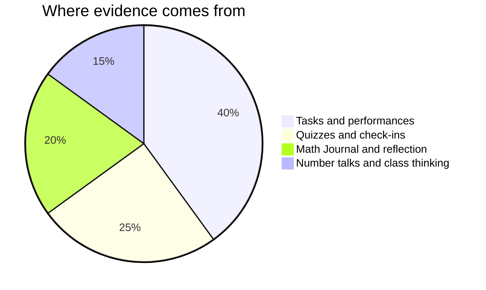

Marks in mathematics worry people, usually because of one misunderstanding:
that you are marked on speed, or on being a "math person". You are not —
no such person exists.[^1] You are marked on **reasoning, growth, and
communication** — things entirely inside your control.

## Where evidence comes from

**Tasks** are the pages in Tasks — each lists its success criteria before
you start, phrased as things an observer could see in your work, not
numbers. Multiple methods welcome; a correct answer with invisible
reasoning scores lower than visible reasoning with a slip in it, because
[[Showing Your Thinking]] is most of the discipline. A model whose every
parameter you can defend outranks a perfect fit you cannot explain —
that standard is [[What Makes a Model Good]], and the tasks apply it.

**Quizzes** are short, frequent, and low-stakes — and they can be
re-attempted after new learning, because the point of a quiz is to find
out what to work on, not to close a book on it. There is no graded
homework in this course: the nightly check-your-understanding questions
are yours, so that you — not the quiz — are the first to know where you
stand.

**Class thinking** counts because the discussion IS the mathematics:
defending an estimate, questioning a step on someone's board, building
on a conjecture. Whiteboard work is group work; what I assess from it is
how you contribute to thinking, never who held the marker.

**Reflection** is your [[Math Journal]]. It is where your growth becomes
visible enough to mark fairly — often the strongest evidence you have.

**Number talks and daily thinking** are the small daily layer: asking
the question half the room needed, catching your own error in public.
Small each day, large over a term.

> [!important] First attempts are never penalised
> Rough work, wrong turns, and revised answers are how mathematics
> actually gets done. The mark follows where your understanding ends up
> and how visibly you got there.

If a mark ever surprises you, ask — the criteria on each task page are
the whole story, and [[Getting Help]] lists the ways to reach me.

[^1]: Decades of research find no "math brain" — only differences in
    preparation, confidence, and how safe people feel making mistakes.
    That last one is why [[Our Classroom Norms]] exist.
