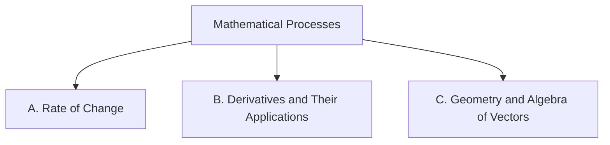

Everything we do in this course points at one or more of these
expectations, from **MCV4U — Calculus and Vectors, Grade 12,
University Preparation**. Lesson pages link here so you can
always see *why* we are doing something.

> [!info] Where these come from
> The wording below is the Ontario curriculum's own. See
> [[About These Expectations]] — including a note about the codes.

Seven mathematical processes run through every strand; the strands
name the mathematics itself.

## The mathematical processes

![[Mathematical Process Expectations]]

## Overall and specific expectations

### Strand A. Rate of Change
*By the end of this course, students will:*

![[A1. Investigating Instantaneous Rate of Change at a Point]]
![[A1.1]]
![[A1.2]]
![[A1.3]]
![[A1.4]]
![[A1.5]]
![[A1.6]]
![[A2. Investigating the Concept of the Derivative Function]]
![[A2.1]]
![[A2.2]]
![[A2.3]]
![[A2.4]]
![[A2.5]]
![[A2.6]]
![[A2.7]]
![[A2.8]]
![[A3. Investigating the Properties of Derivatives]]
![[A3.1]]
![[A3.2]]
![[A3.3]]
![[A3.4]]
![[A3.5]]

### Strand B. Derivatives and Their Applications
*By the end of this course, students will:*

![[B1. Connecting Graphs and Equations of Functions and Their Derivatives]]
![[B1.1]]
![[B1.2]]
![[B1.3]]
![[B1.4]]
![[B1.5]]
![[B2. Solving Problems Using Mathematical Models and Derivatives]]
![[B2.1]]
![[B2.2]]
![[B2.3]]
![[B2.4]]
![[B2.5]]

### Strand C. Geometry and Algebra of Vectors
*By the end of this course, students will:*

![[C1. Representing Vectors Geometrically and Algebraically]]
![[C1.1]]
![[C1.2]]
![[C1.3]]
![[C1.4]]
![[C2. Operating With Vectors]]
![[C2.1]]
![[C2.2]]
![[C2.3]]
![[C2.4]]
![[C2.5]]
![[C2.6]]
![[C2.7]]
![[C2.8]]
![[C3. Describing Lines and Planes Using Linear Equations]]
![[C3.1]]
![[C3.2]]
![[C3.3]]
![[C4. Describing Lines and Planes Using Scalar, Vector, and Parametric Equations]]
![[C4.1]]
![[C4.2]]
![[C4.3]]
![[C4.4]]
![[C4.5]]
![[C4.6]]
![[C4.7]]
