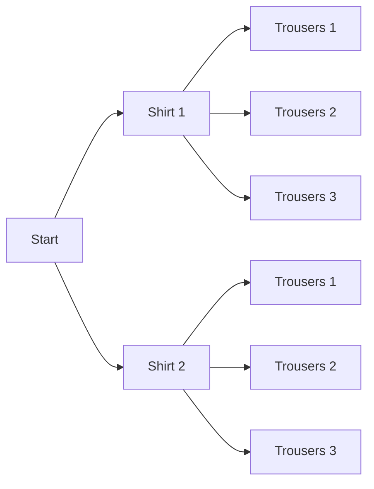

At the boards in [[Counting Without Counting]] your group started by
listing. Two shirts, three pairs of trousers, two pairs of shoes — you
wrote out every outfit, got twelve, and were pleased. Then the next
prompt said four letters followed by three digits, and the listing
died on the spot. Somebody in the room said the sentence that this
whole unit is built on: *we do not need the list, we need the count*.

## Multiply when the choices stack

If a task is a sequence of independent stages, and stage one can be
done $m$ ways and stage two can be done $n$ ways, the whole task can
be done $m \times n$ ways. The reasoning is visible in a tree: every
branch at the first level sprouts a full copy of the second level.

Six endpoints, and shoes would double each of them to twelve. The tree
is the proof; the multiplication is the shortcut. Extend it to as many
stages as you like — that licence plate is
$26 \times 26 \times 26 \times 26 \times 10 \times 10 \times 10$, or
$456\,976\,000$ plates, and nobody had to write one down.

## Add when the cases are separate

The multiplicative principle handles *and*. The additive principle
handles *or*: if two ways of finishing a task cannot both happen, add
their counts. Choosing one book from a shelf of 6 novels **or** 4
biographies gives $6 + 4 = 10$ choices. Choosing one novel **and** one
biography gives $6 \times 4 = 24$ pairs.

The word that decides it is not always printed in the question, so
read for the structure instead: are these stages of one task, or
alternatives to it? Getting that wrong is the single most common error
in this unit, and it survives all the way into
[[The Binomial Distribution]] if you let it.

## Restrictions come first

When a stage has a condition attached, satisfy the condition before
you count anything free. Four-letter, three-digit plates with no
repeated character: the letters run
$26 \times 25 \times 24 \times 23 = 358\,800$ and the digits run
$10 \times 9 \times 8 = 720$, so there are $258\,336\,000$ plates —
about 57% of the unrestricted count.

Sometimes the cheapest route is the complement: count everything, then
subtract what you do not want. Five-character passwords from 36
characters with **at least one digit** is
$36^5 - 26^5 = 48\,584\,800$, because "at least one" has many cases
and "none at all" has exactly one. That trick reappears constantly in
[[Probability Basics]].

Both principles are doing the same job the rest of the unit does —
counting a set too large to list. When order inside a selection
matters, the next page, [[Permutations]], gives the multiplication a
name; when it does not, [[Combinations]] divides the overcount away.
Drill both in [[Counting Practice]].

%%curriculum-start%%
## Curriculum connection

![[A2.1]]

![[A2.3]]

![[A2.5]]
%%curriculum-end%%
