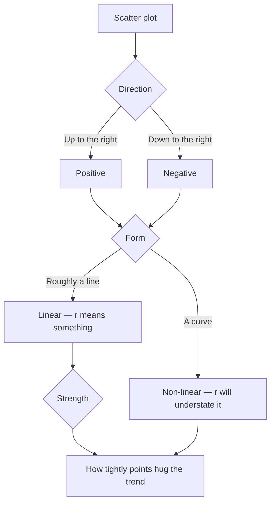

The cloud of dots went up and the room started guessing. "It goes up."
"It's strong." "There's one weird point over there." Every one of
those sentences was about a different property, and until you name
them separately you cannot say anything precise about a scatter plot.
Direction, form, strength — plus outliers — and only after all four
are you allowed to use the word "correlation".

## Three questions a scatter plot answers

The explanatory variable goes on the horizontal axis, the response
variable on the vertical, and then you interrogate the picture in a
fixed order.

Asking about strength before checking form is the classic error, and
it is not harmless — a perfect parabola can produce a correlation
coefficient near zero while your eye can see the relationship from
across the room. Look at the plot first. Always.

## The correlation coefficient

The **correlation coefficient** $r$ measures how well the data fits a
*linear* model. It runs from $-1$ to $1$: the sign gives direction,
the magnitude gives strength, and $r = 0$ means no linear trend at
all. Technology computes it; your job is reading it.

| $\lvert r \rvert$ | Rough reading |
| --- | --- |
| $0.9$ to $1.0$ | Very strong linear pattern |
| $0.7$ to $0.9$ | Strong |
| $0.4$ to $0.7$ | Moderate — visible, but a poor predictor |
| $0.0$ to $0.4$ | Weak; treat "trends" here with suspicion |

Those bands are conventions, not laws, and they mean different things
in different fields. What is not a convention is $r^2$, the
**coefficient of determination**: it is the proportion of the
variation in $y$ that the linear model accounts for. An $r$ of $0.7$
sounds impressive until you notice $r^2 = 0.49$ — the model explains
under half of what is going on.

Three cautions worth carrying permanently. $r$ has no units and does
not change if you switch from centimetres to metres. $r$ is not
resistant, so one distant point can inflate or destroy it. And $r$
says nothing whatever about *why* the two variables move together —
which is the whole argument of [[Correlation and Causation]].

## The line of best fit, and residuals

**Linear regression** finds the line $\hat{y} = ax + b$ that makes the
squared vertical distances to the data as small as possible.
Technology fits it; you interpret the pieces. The slope $a$ is the
predicted change in $y$ per one-unit increase in $x$ — with units
attached, always. The intercept $b$ is the prediction at $x = 0$, and
it is often meaningless in context, which is fine as long as you say
so rather than quietly reporting it.

A **residual** is what the model missed for one data point:

$$\text{residual} = y - \hat{y}$$

Positive means the point sits above the line, negative below. For a
set of study-hours-and-marks data with $\hat{y} = 3.54x + 49.2$, a
student who studied 7 hours and scored 70 has
$\hat{y} = 73.98$ and a residual of about $-3.98$ — four marks below
what the model expected. Scan the residuals and two things show up
immediately: individual points that do not belong to the pattern, and
a curved pattern in the residuals themselves, which means a line was
the wrong model from the start.

## When both variables are categorical

Scatter plots need numbers. For two categorical attributes — grade and
part-time job, transport method and punctuality — the right summary is
a **contingency table** of counts, with row and column totals, and the
right comparison is between conditional proportions rather than raw
counts. The reasoning is the one you built in
[[Conditional Probability]], and the graphical partner is side-by-side
bar graphs or boxplots.

Fit lines, read residuals, and argue about $r$ in
[[Regression and Inference Practice]]; [[Using Desmos]] will do the
fitting in about four clicks. Then go hunting for correlations that
mean nothing at all in [[The Spurious Correlation Hunt]].

%%curriculum-start%%
## Curriculum connection

![[D2.1]]

![[D2.3]]

![[D2.4]]

![[D2.5]]
%%curriculum-end%%
