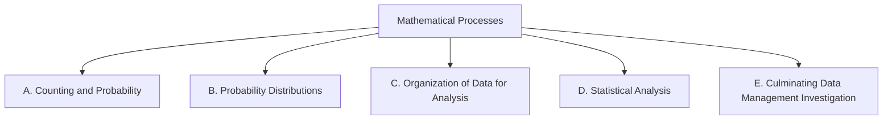

Everything we do in this course points at one or more of these
expectations, from **MDM4U — Mathematics of Data Management,
Grade 12, University Preparation**. Lesson pages link here so you
can always see *why* we are doing something.

> [!info] Where these come from
> The wording below is the Ontario curriculum's own. See
> [[About These Expectations]] — including a note about the codes.

Seven mathematical processes run through every strand; the strands
name the mathematics itself.

## The mathematical processes

![[Mathematical Process Expectations]]

## Overall and specific expectations

### Strand A. Counting and Probability
*By the end of this course, students will:*

![[A1. Solving Probability Problems Involving Discrete Sample Spaces]]
![[A1.1]]
![[A1.2]]
![[A1.3]]
![[A1.4]]
![[A1.5]]
![[A1.6]]
![[A2. Solving Problems Using Counting Principles]]
![[A2.1]]
![[A2.2]]
![[A2.3]]
![[A2.4]]
![[A2.5]]

### Strand B. Probability Distributions
*By the end of this course, students will:*

![[B1. Understanding Probability Distributions for Discrete Random Variables]]
![[B1.1]]
![[B1.2]]
![[B1.3]]
![[B1.4]]
![[B1.5]]
![[B1.6]]
![[B1.7]]
![[B2. Understanding Probability Distributions for Continuous Random Variables]]
![[B2.1]]
![[B2.2]]
![[B2.3]]
![[B2.4]]
![[B2.5]]
![[B2.6]]
![[B2.7]]
![[B2.8]]

### Strand C. Organization of Data for Analysis
*By the end of this course, students will:*

![[C1. Understanding Data Concepts]]
![[C1.1]]
![[C1.2]]
![[C1.3]]
![[C2. Collecting and Organizing Data]]
![[C2.1]]
![[C2.2]]
![[C2.3]]
![[C2.4]]
![[C2.5]]

### Strand D. Statistical Analysis
*By the end of this course, students will:*

![[D1. Analysing One-Variable Data]]
![[D1.1]]
![[D1.2]]
![[D1.3]]
![[D1.4]]
![[D1.5]]
![[D2. Analysing Two-Variable Data]]
![[D2.1]]
![[D2.2]]
![[D2.3]]
![[D2.4]]
![[D2.5]]
![[D3. Evaluating Validity]]
![[D3.1]]
![[D3.2]]
![[D3.3]]

### Strand E. Culminating Data Management Investigation
*By the end of this course, students will:*

![[E1. Designing and Carrying Out a Culminating Investigation]]
![[E1.1]]
![[E1.2]]
![[E1.3]]
![[E1.4]]
![[E1.5]]
![[E2. Presenting and Critiquing the Culminating Investigation]]
![[E2.1]]
![[E2.2]]
![[E2.3]]
![[E2.4]]
