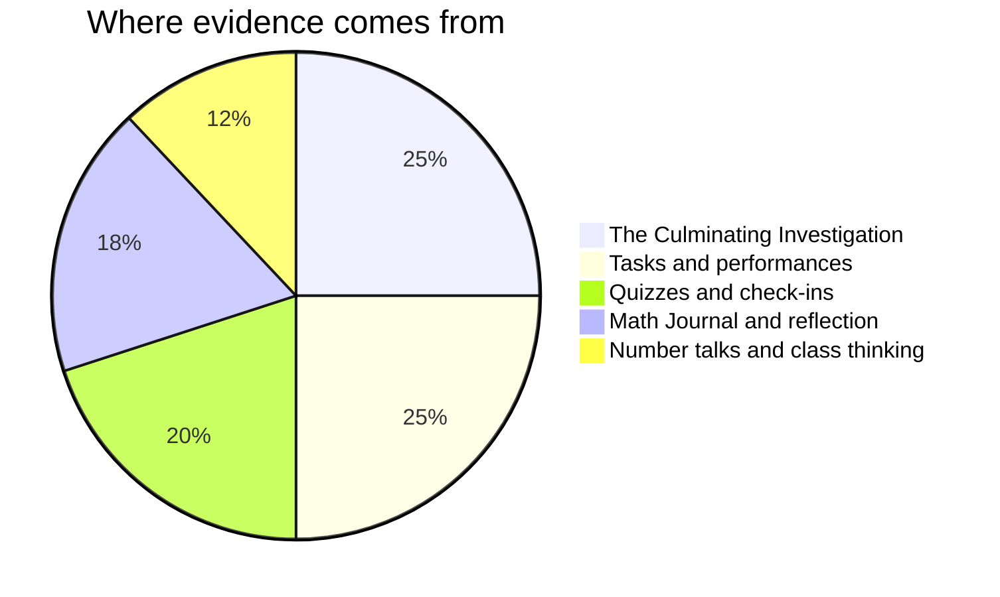

Marks in mathematics worry people, usually because of one
misunderstanding: that you are marked on speed, or on being a "math
person". You are not — no such person exists.[^1] You are marked on
**reasoning, growth, and communication** — things entirely inside
your control. In this course communication carries more weight than
it did in any earlier one, because a statistical result that nobody
can follow is not a result. It is a number.

## Where evidence comes from

**[[The Culminating Investigation]]** is the largest single piece of
evidence in the course, and it is assessed all semester rather than
at the end: the question you chose and narrowed, the data you found
and rejected, the analysis, the report, and the defence at
[[The Data Symposium]]. It cannot be produced in a week, and the
schedule is built so that it does not have to be.

**Tasks** are the pages in Tasks — each lists its success criteria
before you start, phrased as things an observer could see in your
work, not numbers. Multiple methods welcome; a correct answer with
invisible reasoning scores lower than visible reasoning with a slip
in it, because [[Showing Your Thinking]] is most of the discipline.
A conclusion that names its own limitations outranks a bolder one
that does not — the standard [[What Makes a Model Good]] argues for
and the tasks apply.

**Quizzes** are short, frequent, and low-stakes — and they can be
re-attempted after new learning, because the point of a quiz is to
find out what to work on, not to close a book on it. There is no
graded homework in this course: the nightly check-your-understanding
questions are yours, so that you — not the quiz — are the first to
know where you stand.

**Class thinking** counts because the discussion IS the mathematics:
defending an estimate, questioning whether a sample supports a claim,
building on someone's conjecture. Whiteboard work is group work; what
I assess from it is how you contribute to thinking, never who held
the marker.

**Reflection** is your [[Math Journal]]. It is where your growth
becomes visible enough to mark fairly — and in this course it doubles
as the audit trail of your investigation, which makes it the most
load-bearing notebook you will keep this year.

> [!important] First attempts are never penalised
> Rough work, wrong turns, and revised answers are how mathematics
> actually gets done. The mark follows where your understanding ends
> up and how visibly you got there. A dataset you abandoned for a
> reason you can name is evidence of learning, not a wasted month.

If a mark ever surprises you, ask — the criteria on each task page
are the whole story, and [[Getting Help]] lists the ways to reach me.

[^1]: Decades of research find no "math brain" — only differences in
    preparation, confidence, and how safe people feel making
    mistakes. That last one is why [[Our Classroom Norms]] exist.
